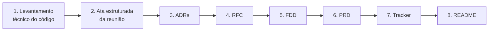

# Da Reunião ao Documento: Design Docs do Sistema de Webhooks

Pacote de design docs da feature **Sistema de Webhooks de Notificação de Pedidos**, produzido com IA a partir da transcrição de uma reunião técnica e do código do Order Management System (OMS). O enunciado original do desafio está no [repositório base](https://github.com/devfullcycle/mba-ia-desafio-design-docs-com-ia).

---

## Sobre o desafio

Uma empresa que opera um OMS em produção decidiu, numa reunião de cerca de 55 minutos entre tech lead, PM, engenheiros e segurança, construir um sistema de webhooks para avisar clientes B2B quando o status dos seus pedidos muda. Nada foi registrado além da transcrição da call. Minha tarefa foi transformar essa conversa, junto com o código existente, num pacote de documentação acionável: PRD, RFC, FDD, ADRs e um Tracker de rastreabilidade. Com ele, o time deve conseguir começar a implementação sem precisar ter participado da reunião.

A parte difícil não era escrever, e sim **filtrar**. A reunião mistura decisões fechadas, requisitos, pontos descartados, itens adiados e dúvidas que ninguém resolveu. Cada item precisa de origem identificável, na transcrição ou no código, e nada pode ser inventado. Usei a IA como ferramenta principal de produção, mas o meu papel foi de maestro: definir o que cada documento precisava conter, revisar criticamente o que ela gerava e corrigir o rumo sempre que o resultado ficava genérico, redundante ou sem lastro.

---

## Ferramentas de IA utilizadas

| Ferramenta | Papel no processo |
| --- | --- |
| **Claude Code** (extensão do VS Code, modelo Claude Opus) | Ferramenta principal. Leu todo o código e a transcrição, gerou cada documento, trabalhou em **plan mode** (um plano aprovado por mim antes de cada entrega), fez perguntas quando havia decisão de autoria e **validou as entregas com scripts**: timestamps contra a transcrição, caminhos de código, IDs duplicados e contagens do Tracker |
| **Obsidian** (apoio, sem IA) | Leitura e organização dos templates do curso (pasta local, não publicada), usados como referência de formato (ex.: `PRD-Exemplo.md`) |

---

## Workflow adotado

### Ordem de produção



1. **Levantamento técnico do código** ([LEVANTAMENTO-TECNICO.md](docs/levantamento-tecnico/LEVANTAMENTO-TECNICO.md)): antes de tocar na transcrição, pedi à IA um mapeamento completo do OMS. Entraram arquitetura, padrões, modelo de dados, máquina de estados, transação do `changeStatus`, hierarquia de erros e middlewares. Isso deu o vocabulário para os ganchos de integração.
2. **Ata estruturada** ([ATA-REUNIAO-WEBHOOKS.md](docs/levantamento-tecnico/ATA-REUNIAO-WEBHOOKS.md)): a transcrição foi convertida numa ata com IDs e origem `[hh:mm] Nome` em cada item. Ficou separado o que é decisão (DT), requisito (RF/RNF), alternativa descartada (ALT), fora de escopo (FE), evolução (EV), questão em aberto (QA) e lacuna nunca discutida (LAC). A partir daí, **nenhum documento precisou reler a transcrição**: todos consomem a ata.
3. **ADRs primeiro**, porque as decisões são o esqueleto do resto. Depois a **RFC**, que consolida a proposta e aponta para as ADRs.
4. **FDD**, o documento mais técnico, com a seção de integração ancorada no código real.
5. **PRD** por último entre os grandes: com os demais prontos, virou uma consolidação em linguagem de produto.
6. **Tracker**, varrendo os quatro documentos prontos, e por fim este README.

### Como organizei a interação com a IA

- **Plano antes de escrever.** Para cada documento, a IA propunha um plano (estrutura, fontes, regras e verificação) e só executava depois da minha aprovação. Ajustei planos antes da execução mais de uma vez, por exemplo para escolher quais prompts entram neste README.
- **Perguntas em vez de suposições.** Quando havia uma escolha que era minha, a IA perguntava. Exemplos: quem assina cada documento, se os documentos deveriam citar falas, como tratar pontos não decididos no FDD e como lidar com probabilidades de risco que a reunião não estimou.
- **Verificação ao final de cada entrega.** Toda entrega terminou com checagens automáticas: seções obrigatórias por `grep`, citações `[hh:mm] Nome` confrontadas com a transcrição, links e caminhos de código verificados no disco, IDs únicos e contagens do Tracker recalculadas.
- **Um prompt reexecutável por documento**, salvo em [docs/prompts/](docs/prompts/), para que qualquer documento possa ser regenerado em outra sessão com o mesmo resultado.

### Convenções que surgiram no caminho

| Convenção | Onde | Por quê |
| --- | --- | --- |
| Documentos **sem** `[hh:mm] Nome`; rastreio centralizado no Tracker | PRD, RFC, FDD, ADRs | Documento de decisão não é transcrição; o Tracker é o lugar da rastreabilidade |
| Marcador **🔶** para propostas e estimativas | FDD (P-01 a P-23), PRD | Deixa explícito o que foi definido pelo documento, e não pela reunião |
| IDs cruzados (DT, ALT, QA, LAC, P-xx) | Ata, ADRs, RFC, FDD, Tracker | Permite seguir um item de ponta a ponta entre documentos |

---

## Prompts customizados

Os prompts completos e reexecutáveis de cada documento estão em [docs/prompts/](docs/prompts/). Abaixo, os dois mais relevantes, condensados.

### 1. Prompt das ADRs

Comecei com um enunciado próprio, curto e com erros de digitação (`cocs/adrs`, `,md`), que dependia do contexto da conversa (ex.: "requisito 4"). Depois da primeira geração, pedi à IA para **fundir o meu enunciado com o plano que tinha funcionado**, formando um prompt autocontido. A versão final também incorporou a correção de estilo da iteração 1 (sem citações de fala). Versão completa: [PROMPT-ADRS.md](docs/prompts/PROMPT-ADRS.md).

````text
# Contexto
Você vai produzir os ADRs da feature "Sistema de Webhooks de Notificação de Pedidos"
de um OMS (Node.js + TypeScript, Express, Prisma, MySQL). Deve existir um ADR para cada
decisão arquitetural isolada, com contexto e consequências, respondendo:
"Por que decidimos exatamente assim?"
Não assuma nada que não esteja nas fontes. Leia os arquivos antes de escrever.

# Fontes (em ordem de prioridade)
1. docs/levantamento-tecnico/ATA-REUNIAO-WEBHOOKS.md (DT, ALT, FE, LIM, QA, LAC)
2. TRANSCRICAO.md (validar e completar o que faltar na ata)
3. docs/levantamento-tecnico/LEVANTAMENTO-TECNICO.md
4. Código em src/ e prisma/ (para citar arquivos, módulos e classes reais)

# Saída
Pasta docs/adrs/, arquivos ADR-{NNN}-{titulo-em-kebab-case}.md (entre 5 e 8).
ADRs: 001 outbox no MySQL | 002 worker separado com polling | 003 retry com backoff e DLQ |
004 HMAC-SHA256 com secret por endpoint | 005 at-least-once com X-Event-Id |
006 reuso dos padrões existentes. Decisões secundárias (payload, headers, 64 KB, timeout)
entram como fatores do ADR relacionado; o detalhamento é do FDD.

# Estrutura de cada ADR
Tabela de metadados (Status, Data, Decisores por papel, Relacionados) e as seções:
## Status
## Contexto            -> problema e restrições
## Decisão             -> fatores que influenciaram + "Justificativa principal" em destaque
## Alternativas Consideradas -> prós, contras e motivo do descarte de cada uma
## Consequências       -> positivas / negativas e trade-offs / riscos e impactos
                          operacionais / pontos em aberto (com IDs QA/LAC da ata)
## Referências         -> links para código real + IDs da ata

# Regras
- Não invente: toda decisão, restrição ou alternativa tem origem na ata, na transcrição ou no código.
- ADR não é rastreio da conversa: nada de [hh:mm] Nome no corpo; responsáveis só em
  "Decisores", de forma macro. O rastreio fala a fala fica na ata e no Tracker.
- Código real com link relativo; arquivos futuros marcados "(a criar)".
- Itens fora de escopo nunca aparecem como decisão.
- Conciso (~1 a 1,5 página), sem schema nem pseudocódigo.

# Checklist
- [ ] 5 a 8 arquivos ADR-NNN-titulo-em-kebab-case.md
- [ ] Cada ADR com Status, Contexto, Decisão, Alternativas Consideradas e Consequências
- [ ] Cobre pelo menos 5 das 6 decisões principais
- [ ] Pelo menos 1 ADR referencia arquivos/classes do código base
- [ ] Zero ocorrências de [hh:mm] nos ADRs

# Verificação (reportar)
ls com regex do nome; contagem das 5 seções por arquivo; grep de [hh:mm] = 0;
links ../../ apontando para arquivos existentes; varredura dos itens fora de escopo.
````

### 2. Prompt do PRD

Escrito para o último dos documentos grandes, com duas preocupações: seguir o **formato do PRD de exemplo do curso** e resolver o conflito entre o critério de aceite (riscos com probabilidade) e a regra de não inventar, já que a reunião nunca estimou probabilidades. Versão completa: [PROMPT-PRD.md](docs/prompts/PROMPT-PRD.md).

````text
# Contexto
Você vai produzir o PRD da feature "Sistema de Webhooks de Notificação de Pedidos".
O PRD responde "por que e o quê": problema, público, escopo, requisitos e métricas.
Como vem depois da RFC, das ADRs e do FDD, ele é uma consolidação em linguagem de produto.
Detalhes de implementação (paths, payloads, tabelas) ficam no FDD e só são referenciados.

# Fontes
1. Ata (CTX, RF, RNF, FE, EV, LIM, RSK, dependências, prazo)
2. docs/adrs/ (decisões e trade-offs)
3. docs/RFC.md e docs/FDD.md (questões em aberto e propostas P-xx)
4. docs/mba-templates-guia/PRD-Exemplo.md  -> FORMATO A SEGUIR

# Saída
docs/PRD.md. Metadados: Versão v1, Data, Responsável: Marcos (Product Manager),
Revisores, Status, links para RFC/FDD/ADRs/ata.

# Estrutura (formato do PRD-Exemplo)
1 Resumo e contexto da feature | 2 Problema e motivação | 3 Público-alvo e cenários de uso |
4 Objetivos e métricas de sucesso (Objetivo | Métrica | Meta | Origem) |
5 Escopo: Incluso / Fora de escopo (tabela Item | Situação: descartado ou adiado) / Evoluções |
6 Requisitos funcionais, cada um como:
    ### RF-NNN Nome
    **Fluxo principal** / **Fluxos alternativos e exceções** / **Erros previstos** / **Prioridade**
  (mínimo 8 RFs discutidos na reunião) |
7 Requisitos não funcionais por categoria | 8 Arquitetura e abordagem (curta) |
9 Decisões e trade-offs (Justificativa + Trade-off, link para cada ADR) |
10 Dependências (organizacional, técnica, externa) |
11 Riscos: **Probabilidade**, **Impacto**, **Mitigação**, **Plano de contingência** |
12 Critérios de aceitação | 13 Estratégia de testes e validação | 14 Questões em aberto

# Regras
- Não invente requisitos, decisões ou restrições.
- ESTIMAR E MARCAR: a reunião não estimou probabilidades nem definiu metas além das
  citadas. Quando o formato exigir, estime com base em fatos da reunião
  (ex.: "já houve cliente que vazou secret") e marque com 🔶 como estimativa a validar.
  Propostas do FDD usadas no PRD também recebem 🔶 e o ID P-xx.
- Nível de produto: sem tabelas, payload campo a campo, códigos HTTP ou paths.
- Sem [hh:mm] Nome; nomes só nos metadados e como responsáveis de dependências.
- Fora de escopo nunca aparece como requisito.

# Checklist
- [ ] As 12 seções obrigatórias | [ ] >= 8 RFs | [ ] >= 1 meta quantitativa
- [ ] Fora de escopo com >= 2 itens descartados/adiados
- [ ] >= 2 riscos com probabilidade, impacto e mitigação | [ ] toda estimativa marcada com 🔶
````

---

## Iterações e ajustes

O pacote passou por **7 iterações principais**, além de ajustes menores. Cada linha abaixo é um momento real em que a IA gerou algo errado, superficial ou em tensão com os critérios, e o que foi feito.

| # | O que a IA gerou | Problema identificado | Ajuste feito |
| --- | --- | --- | --- |
| 1 | **ADRs v1** com citações `[09:06] Diego`, `[09:17] Larissa` ao longo de todo o texto e listas de horários nas referências | A ADR virou um rastreio da conversa, em vez de registrar decisão, justificativa e consequência | Pedi a reescrita das 6 ADRs sem horários nem "fulano disse", com os responsáveis só nos metadados e de forma macro. O rastreio passou para o Tracker. O prompt das ADRs, o índice da pasta e, depois, RFC, FDD e PRD adotaram a mesma regra |
| 2 | **Enunciado das ADRs** que eu mesmo escrevi, com erros de digitação e dependente de "requisito 4" (contexto de fora) | Não servia para ser reexecutado em outra sessão | Pedi um merge do enunciado com o plano aprovado, gerando [PROMPT-ADRS.md](docs/prompts/PROMPT-ADRS.md) autocontido. Esse formato virou padrão para todos os documentos |
| 3 | `docs/adrs/README.md` do repositório base prescrevia nomes `0001-titulo.md` | Conflitava com o padrão exigido `ADR-NNN-titulo.md` e poderia confundir a avaliação da pasta | O README da pasta virou um índice das ADRs com a convenção correta |
| 4 | **FDD** precisava de contratos concretos, mas a reunião deixou em aberto paths do CRUD, formato do `X-Signature`, critério de sucesso HTTP, recuperação de eventos presos etc. | Tensão entre ser acionável e não inventar | Adotei a regra **"propor e marcar"**: cada definição não decidida recebe 🔶 no texto e entra numa tabela de 23 propostas (P-01 a P-23), com o ID da ata e o papel que precisa validar |
| 5 | No FDD, a exigência de HTTPS ficava **só no schema Zod**, como disse a reunião | Lendo o código, `validate.middleware.ts` converte toda falha Zod em `VALIDATION_ERROR`, e o código `WEBHOOK_INVALID_URL` citado na reunião nunca seria retornado. Do mesmo modo, `NotFoundError` fixa o código `NOT_FOUND` | A checagem do esquema `https` foi para o service; os erros 404 do módulo passaram a estender `AppError` diretamente. Aproveitei para corrigir o título da seção para "Matriz de erros previstos" (nome exigido) e explicitar o upsert na DLQ, que conflitava com a chave única |
| 6 | **PRD** exigia riscos com probabilidade, mas a reunião nunca estimou nenhuma. A primeira versão também trazia propostas do FDD escritas como fato (replay com o mesmo `event_id`, listagem paginada) | Critério de aceite vs. regra de não inventar | Probabilidades estimadas a partir de fatos da reunião (ex.: "já houve vazamento de secret") e marcadas com 🔶; as propostas do FDD citadas no PRD também ganharam 🔶 e o ID P-xx |
| 7 | **Tracker** com a distribuição por fonte escrita "de cabeça" (380 transcrição / 51 código) | A contagem real por script deu 379 / 52 | Números corrigidos pelo script, que também validou os 431 IDs (sem duplicados), os timestamps contra a transcrição e os 21 caminhos de código |

Outros cuidados que apareceram na **ata**, base de todo o resto:

- As 95 citações `[hh:mm] Nome` foram validadas uma a uma contra a transcrição.
- A ata separa **questões levantadas e não decididas** de **lacunas nunca discutidas**, para que nenhuma delas virasse requisito por engano.
- Registrou duas **divergências entre a fala e o código**:
  - na reunião, a transação de status "decrementa estoque"; no código, o débito só ocorre em `PENDING → PAID`;
  - fala-se em "usuários que representam o cliente", mas o schema não relaciona `User` e `Customer`.

---

## Como navegar a entrega

### Arquivos entregues

```
.
├── README.md                                  este documento (processo)
├── TRANSCRICAO.md                             transcrição original (não alterada)
└── docs/
    ├── PRD.md                                 produto: por que e o quê
    ├── RFC.md                                 proposta técnica para revisão
    ├── FDD.md                                 especificação de implementação
    ├── TRACKER.md                             rastreabilidade de cada item → transcrição/código
    ├── adrs/
    │   ├── README.md                          índice das ADRs
    │   ├── ADR-001-outbox-no-mysql.md
    │   ├── ADR-002-worker-separado-com-polling.md
    │   ├── ADR-003-retry-backoff-exponencial-e-dlq.md
    │   ├── ADR-004-hmac-sha256-secret-por-endpoint.md
    │   ├── ADR-005-entrega-at-least-once-com-x-event-id.md
    │   └── ADR-006-reuso-dos-padroes-existentes.md
    ├── levantamento-tecnico/                  material de apoio
    │   ├── LEVANTAMENTO-TECNICO.md            análise do código existente
    │   └── ATA-REUNIAO-WEBHOOKS.md            ata estruturada com IDs e origem
    └── prompts/                               prompts reexecutáveis por documento
        ├── PROMPT-ADRS.md
        ├── PROMPT-RFC.md
        ├── PROMPT-FDD.md
        ├── PROMPT-PRD.md
        └── PROMPT-TRACKER.md
```

### Ordem sugerida de leitura

A ordem sobe da visão de produto para o detalhe de implementação, e é diferente da ordem em que os documentos foram produzidos.

| # | Documento | Para quê |
| --- | --- | --- |
| 1 | [PRD](docs/PRD.md) | Entender o problema, o público, o escopo (e o que ficou de fora), os requisitos e as metas |
| 2 | [RFC](docs/RFC.md) | Ver a proposta técnica, as alternativas descartadas e as questões em aberto |
| 3 | [ADRs](docs/adrs/README.md) | Entender por que cada decisão arquitetural foi tomada assim |
| 4 | [FDD](docs/FDD.md) | Detalhe de implementação: fluxos, contratos, erros, resiliência, observabilidade e integração com o código |
| 5 | [Tracker](docs/TRACKER.md) | Conferir a origem de qualquer item na transcrição ou no código |
| — | [Ata](docs/levantamento-tecnico/ATA-REUNIAO-WEBHOOKS.md) e [Levantamento técnico](docs/levantamento-tecnico/LEVANTAMENTO-TECNICO.md) | Apoio: a reunião organizada por tipo de item e o mapa do código existente |

---

## Enunciado original e restrições

- O enunciado completo do desafio está no [repositório base](https://github.com/devfullcycle/mba-ia-desafio-design-docs-com-ia).
- A entrega é **puramente documental**: nenhum arquivo de `src/`, `prisma/`, `tests/` ou de configuração da aplicação foi alterado. O código serviu apenas de contexto e referência.
