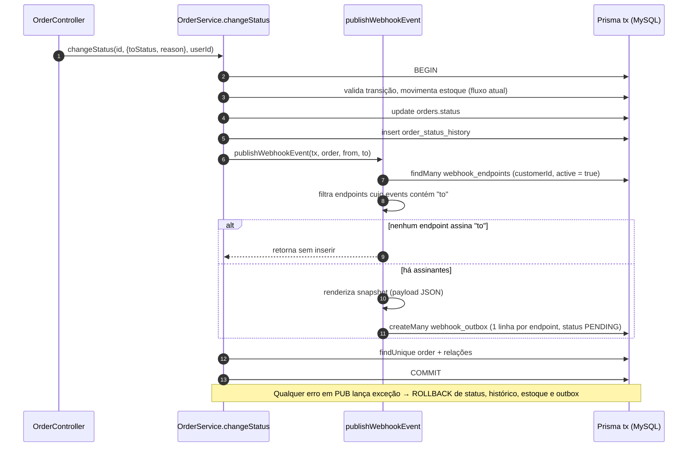
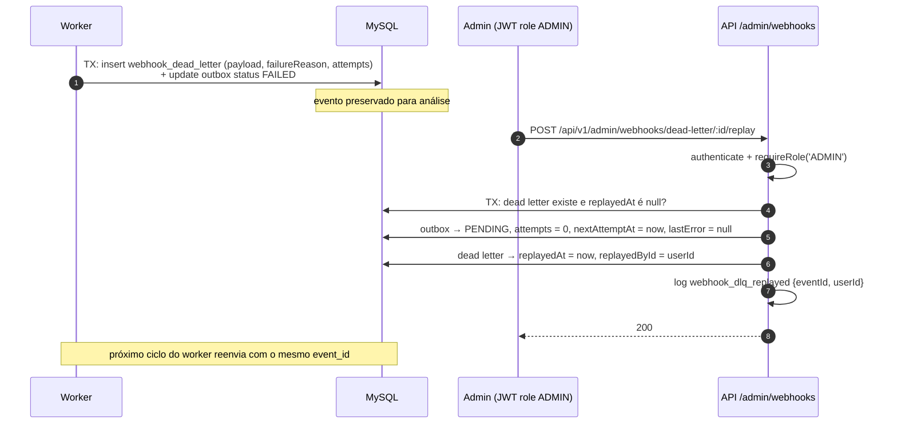

# FDD — Sistema de Webhooks de Notificação de Pedidos

| Campo | Valor |
| --- | --- |
| Feature | Sistema de Webhooks de Notificação de Pedidos |
| Autora | Larissa (Tech Lead) |
| Revisores | Bruno (time de Pedidos), Diego (time de Plataforma), Sofia (Segurança) |
| Status | Rascunho para revisão |
| Data | 28/09/2026 |
| Documentos de origem | [RFC-001](RFC.md), [ADR-001 a ADR-006](adrs/README.md), [Ata da reunião](levantamento-tecnico/ATA-REUNIAO-WEBHOOKS.md), [Levantamento técnico](levantamento-tecnico/LEVANTAMENTO-TECNICO.md) |

> **Como ler este documento.** O FDD detalha **como construir**. O **porquê** de cada decisão está nas ADRs e não é repetido aqui. Pontos que a reunião não decidiu recebem uma definição proposta neste FDD, marcada com **🔶 Proposta**; todas as propostas estão consolidadas na [seção 14](#14-decisões-de-implementação-propostas--pendentes-de-validação), com o ID correspondente da ata (QA-xx / LAC-xx), e precisam ser validadas pelos revisores.

---

## Sumário

1. [Contexto e motivação técnica](#1-contexto-e-motivação-técnica)
2. [Objetivos técnicos](#2-objetivos-técnicos)
3. [Escopo e exclusões](#3-escopo-e-exclusões)
4. [Modelo de dados](#4-modelo-de-dados)
5. [Fluxos detalhados](#5-fluxos-detalhados)
6. [Contratos públicos](#6-contratos-públicos)
7. [Matriz de erros previstos](#7-matriz-de-erros-previstos)
8. [Estratégias de resiliência](#8-estratégias-de-resiliência)
9. [Observabilidade](#9-observabilidade)
10. [Integração com o sistema existente](#10-integração-com-o-sistema-existente)
11. [Dependências e compatibilidade](#11-dependências-e-compatibilidade)
12. [Critérios de aceite técnicos](#12-critérios-de-aceite-técnicos)
13. [Riscos e mitigação](#13-riscos-e-mitigação)
14. [Decisões de implementação propostas — pendentes de validação](#14-decisões-de-implementação-propostas--pendentes-de-validação)
15. [Referências](#15-referências)

---

## 1. Contexto e motivação técnica

Clientes B2B precisam ser notificados em menos de 10 segundos quando o status de um pedido muda. Hoje eles fazem polling em `GET /api/v1/orders`. O OMS não tem nenhum mecanismo de eventos, filas ou jobs em background, e a origem natural do evento, `OrderService.changeStatus` ([src/modules/orders/order.service.ts](../src/modules/orders/order.service.ts)), já executa uma transação interativa que valida a máquina de estados, movimenta estoque, atualiza o pedido e grava o histórico.

A solução aprovada na [RFC-001](RFC.md) combina:

| Bloco | Decisão | ADR |
| --- | --- | --- |
| Publicação | Evento gravado numa outbox no MySQL, na mesma transação do `changeStatus` | [ADR-001](adrs/ADR-001-outbox-no-mysql.md) |
| Entrega | Worker em processo separado, polling a cada 2 s | [ADR-002](adrs/ADR-002-worker-separado-com-polling.md) |
| Falhas | Backoff 1m/5m/30m/2h/12h, DLQ em tabela separada, replay manual por ADMIN | [ADR-003](adrs/ADR-003-retry-backoff-exponencial-e-dlq.md) |
| Segurança | HMAC-SHA256 com secret por endpoint, rotação com 24 h de convivência, HTTPS | [ADR-004](adrs/ADR-004-hmac-sha256-secret-por-endpoint.md) |
| Garantia | At-least-once com `X-Event-Id` | [ADR-005](adrs/ADR-005-entrega-at-least-once-com-x-event-id.md) |
| Padrões | Novo módulo no molde dos existentes, `AppError`, códigos `WEBHOOK_*`, Pino, Zod, `requireRole` | [ADR-006](adrs/ADR-006-reuso-dos-padroes-existentes.md) |

---

## 2. Objetivos técnicos

| ID | Objetivo | Meta verificável |
| --- | --- | --- |
| OT-01 | Latência de detecção | Worker consulta a outbox a cada **2 s**; entrega iniciada em até ~2 s após o commit, bem abaixo do teto de 10 s |
| OT-02 | Consistência | **100%** das mudanças de status com assinatura ativa geram evento; falha na outbox desfaz a mudança de status |
| OT-03 | Garantia de entrega | At-least-once; cada evento tem `X-Event-Id` estável entre tentativas e replays |
| OT-04 | Isolamento | A duração de `changeStatus` não depende da disponibilidade de nenhum cliente |
| OT-05 | Resiliência | Até 5 reenvios em ~14 h 36 min após a primeira falha; depois, DLQ (contagem conforme 🔶 P-05) |
| OT-06 | Timeout | Cada chamada HTTP é abortada em **10 s** |
| OT-07 | Limite de payload | Eventos acima de **64 KB** não são enviados |
| OT-08 | Segurança | 100% das entregas assinadas com HMAC-SHA256; apenas URLs `https` aceitas |
| OT-09 | Padrões | Nenhuma biblioteca nova; erros, logs e validação no padrão existente |

---

## 3. Escopo e exclusões

**Incluído**

- Módulo `src/modules/webhooks` (a criar): CRUD de configuração, histórico de entregas, rotação de secret e replay de DLQ.
- Publicação de evento `order.status_changed` a partir de `changeStatus`.
- Worker em `src/worker.ts` (a criar), com entrega, retry, DLQ e recuperação de eventos presos.
- Assinatura HMAC-SHA256, headers de entrega, limite de 64 KB e timeout de 10 s.
- Migration Prisma com as novas tabelas.
- Logs estruturados e métricas propostas.
- Testes de integração no padrão existente.

**Excluído** (decidido na reunião; ver seção 10 da ata)

- Webhooks de entrada.
- Alerta por e-mail em falhas repetidas (próxima fase).
- Rate limiting de envio (em observação).
- Dashboard visual.
- Arquivamento de eventos entregues.
- Múltiplos workers e ordenação global.
- Exactly-once.
- Reprocessamento automático da DLQ.
- Tipos de evento além de `order.status_changed`.

---

## 4. Modelo de dados

Novos models no [prisma/schema.prisma](../prisma/schema.prisma), seguindo as convenções existentes: UUID em `CHAR(36)`, `@@map` em snake_case, timestamps `createdAt`/`updatedAt` e índices nos campos de filtro.

```prisma
enum WebhookOutboxStatus {
  PENDING      // aguardando primeira tentativa ou próximo retry
  PROCESSING   // capturado pelo worker
  DELIVERED    // entregue com sucesso (2xx)
  FAILED       // esgotado ou descartado; se esgotado, copiado para a DLQ
}

model WebhookEndpoint {
  id                      String    @id @default(uuid()) @db.Char(36)
  customerId              String    @db.Char(36)
  url                     String    @db.VarChar(2048)
  secret                  String    @db.VarChar(128)
  previousSecret          String?   @db.VarChar(128)
  previousSecretExpiresAt DateTime?
  events                  Json      // lista de OrderStatus assinados, ex.: ["SHIPPED","DELIVERED"]
  active                  Boolean   @default(true)
  createdAt               DateTime  @default(now())
  updatedAt               DateTime  @updatedAt

  customer    Customer            @relation(fields: [customerId], references: [id], onDelete: Cascade)
  outbox      WebhookOutbox[]
  deliveries  WebhookDelivery[]
  deadLetters WebhookDeadLetter[]

  @@index([customerId])
  @@index([active])
  @@map("webhook_endpoints")
}

model WebhookOutbox {
  id            String              @id @default(uuid()) @db.Char(36) // = event_id / X-Event-Id
  webhookId     String              @db.Char(36)
  orderId       String              @db.Char(36) // sem FK: o snapshot sobrevive à remoção do pedido
  eventType     String              @db.VarChar(64)
  payload       Json                // snapshot renderizado na inserção
  status        WebhookOutboxStatus @default(PENDING)
  attempts      Int                 @default(0)
  nextAttemptAt DateTime            @default(now())
  lockedAt      DateTime?
  lastError     String?             @db.VarChar(500)
  createdAt     DateTime            @default(now())
  updatedAt     DateTime            @updatedAt

  webhook    WebhookEndpoint     @relation(fields: [webhookId], references: [id], onDelete: Cascade)
  deliveries WebhookDelivery[]
  deadLetter WebhookDeadLetter?

  @@index([status, nextAttemptAt])
  @@index([createdAt])
  @@index([webhookId])
  @@index([orderId])
  @@map("webhook_outbox")
}

model WebhookDelivery {
  id           String   @id @default(uuid()) @db.Char(36)
  eventId      String   @db.Char(36)
  webhookId    String   @db.Char(36)
  attempt      Int
  success      Boolean
  httpStatus   Int?
  responseBody String?  @db.Text // trecho inicial da resposta do cliente
  durationMs   Int
  errorCode    String?  @db.VarChar(64)
  createdAt    DateTime @default(now())

  event   WebhookOutbox   @relation(fields: [eventId], references: [id], onDelete: Cascade)
  webhook WebhookEndpoint @relation(fields: [webhookId], references: [id], onDelete: Cascade)

  @@index([webhookId, createdAt])
  @@map("webhook_deliveries")
}

model WebhookDeadLetter {
  id            String    @id @default(uuid()) @db.Char(36)
  eventId       String    @unique @db.Char(36)
  webhookId     String    @db.Char(36)
  payload       Json
  failureReason String    @db.VarChar(500)
  attempts      Int
  failedAt      DateTime  @default(now())
  replayedAt    DateTime?
  replayedById  String?   @db.Char(36)

  event      WebhookOutbox   @relation(fields: [eventId], references: [id], onDelete: Cascade)
  webhook    WebhookEndpoint @relation(fields: [webhookId], references: [id], onDelete: Cascade)
  replayedBy User?           @relation("DeadLetterReplayedBy", fields: [replayedById], references: [id])

  @@index([failedAt])
  @@map("webhook_dead_letter")
}
```

Relações inversas a adicionar: `Customer.webhookEndpoints WebhookEndpoint[]` e `User.replayedDeadLetters WebhookDeadLetter[] @relation("DeadLetterReplayedBy")`.

Notas de modelagem:

- **🔶 Proposta — granularidade:** uma linha de outbox por par (evento × webhook de destino). Cada linha tem seu próprio `id`, usado como `event_id`, porque as tentativas, os retries e a DLQ são por destino.
- **🔶 Proposta — `webhook_deliveries`:** tabela de tentativas que alimenta o endpoint de histórico (LAC-09).
- O status da outbox corresponde aos quatro estados citados na reunião: pendente, processando, entregue e falhou.

---

## 5. Fluxos detalhados

### 5.1 Criação do evento na outbox

A publicação roda **dentro** da transação de `changeStatus`. A função `publishWebhookEvent` (em `src/modules/webhooks/webhook.publisher.ts`, a criar) recebe o `tx` e não abre transação própria.



Regras:

1. Os endpoints são buscados pelo `customerId` do pedido e filtrados em memória pela lista `events`. Um cliente tem poucos endpoints, e isso evita depender de consultas JSON no MySQL.
2. O payload é renderizado uma única vez e reutilizado em todas as linhas. Cada linha recebe seu próprio `id` (UUID), que é também o `event_id` do payload daquela linha.
3. O `timestamp` do payload é o momento da mudança de status (ISO 8601 UTC).

### 5.2 Processamento pelo worker

```mermaid
sequenceDiagram
    autonumber
    participant W as Worker (loop a cada 2 s)
    participant DB as MySQL
    participant C as Endpoint do cliente

    W->>DB: reclaim: PROCESSING com lockedAt antigo → PENDING
    W->>DB: findMany PENDING com nextAttemptAt <= now ORDER BY createdAt LIMIT batch
    W->>DB: updateMany → PROCESSING, lockedAt = now
    loop para cada evento, em ordem
        W->>DB: carrega endpoint (url, secret, previousSecret, active)
        alt endpoint inativo
            W->>DB: status FAILED, lastError WEBHOOK_INACTIVE (sem DLQ)
        else payload > 64 KB
            W->>DB: move para DLQ (WEBHOOK_PAYLOAD_TOO_LARGE), status FAILED
        else
            W->>W: corpo = JSON.stringify(payload); assina HMAC-SHA256
            W->>C: POST url (headers X-*), timeout 10 s
            alt resposta 2xx
                W->>DB: status DELIVERED, attempts+1; insert webhook_deliveries (success)
            else timeout / rede / não-2xx
                W->>DB: insert webhook_deliveries (falha)
                W->>W: aplica política de retry (5.3)
            end
        end
    end
    W->>W: aguarda 2 s e repete
```

Regras:

- **Worker único e sequencial:** os eventos do lote são processados um de cada vez, na ordem de `createdAt`. Isso mantém a ordem por pedido no fluxo normal.
- **🔶 Proposta — tamanho do lote:** padrão de 10 eventos (`WEBHOOK_BATCH_SIZE`). A reunião definiu apenas "batch pequeno".
- **🔶 Proposta — reclaim:** eventos em `PROCESSING` com `lockedAt` há mais de 60 s voltam para `PENDING` no início de cada ciclo (LAC-08). O limite é bem maior que o timeout de 10 s.
- **🔶 Proposta — critério de sucesso:** qualquer resposta **2xx** é sucesso; qualquer outra resposta, timeout ou erro de rede é falha (LAC-06).
- **Registro da tentativa:** cada tentativa grava uma linha em `webhook_deliveries` com `attempt`, `success`, `httpStatus`, trecho inicial da resposta (🔶 até 2 KB), `durationMs` e `errorCode`.

### 5.3 Retry

**🔶 Proposta (QA-05):** 1 envio inicial + 5 reenvios, usando os 5 intervalos decididos. Assim a janela fica em ~14 h 36 min, coerente com as "quase 15 horas" discutidas.

| Tentativa | Momento | Intervalo desde a falha anterior |
| --- | --- | --- |
| 1 (envio inicial) | Primeiro ciclo após o commit | — |
| 2 | Falha 1 + 1 min | 1 min |
| 3 | Falha 2 + 5 min | 5 min |
| 4 | Falha 3 + 30 min | 30 min |
| 5 | Falha 4 + 2 h | 2 h |
| 6 | Falha 5 + 12 h | 12 h |
| — | Falha 6 | Move para DLQ |

Algoritmo aplicado após uma falha:

```ts
const RETRY_DELAYS_MS = [60_000, 300_000, 1_800_000, 7_200_000, 43_200_000];

// attempts já incrementado com a tentativa que acabou de falhar
if (attempts <= RETRY_DELAYS_MS.length) {
  // status volta a PENDING, lockedAt = null, lastError = código da falha
  nextAttemptAt = new Date(Date.now() + RETRY_DELAYS_MS[attempts - 1]);
} else {
  // move para a DLQ com failureReason = 'WEBHOOK_MAX_ATTEMPTS_EXCEEDED: <último erro>'
}
```

### 5.4 DLQ e replay



- **🔶 Proposta (LAC-10):** o replay mantém o **mesmo `event_id`** e zera o contador de tentativas, reiniciando o ciclo completo de retry.
- Um registro de DLQ só pode ser reprocessado enquanto `replayedAt` for nulo. Se o evento reprocessado esgotar as tentativas de novo, o worker faz **upsert** do registro pelo `eventId` (que é `@unique`): atualiza `failureReason`, `attempts` e `failedAt` e zera `replayedAt`/`replayedById`, permitindo um novo replay.

---

## 6. Contratos públicos

Convenções herdadas da API atual:

- prefixo `/api/v1`;
- autenticação `Authorization: Bearer <JWT>` em todas as rotas;
- corpo JSON em **camelCase**;
- erros no envelope `{ "error": { "code", "message", "details?" } }`;
- listagens no envelope `{ "data", "pagination" }` de [src/shared/http/response.ts](../src/shared/http/response.ts).

O **payload enviado ao cliente** (6.9) usa **snake_case**, como definido na reunião.

Representação do recurso `Webhook` usada nas respostas (a secret nunca aparece, exceto em 6.1 e 6.6):

```json
{
  "id": "9b2e6c1a-5d0f-4b8e-9a51-2f7c3e8d4a10",
  "customerId": "c3a1f5e2-7b44-4c1d-8f2a-6e9d0b7a1c55",
  "url": "https://cliente.example.com/webhooks/oms",
  "events": ["SHIPPED", "DELIVERED"],
  "active": true,
  "previousSecretExpiresAt": null,
  "createdAt": "2026-10-01T13:00:00.000Z",
  "updatedAt": "2026-10-01T13:00:00.000Z"
}
```

### 6.1 Cadastrar webhook — `POST /api/v1/webhooks`

**🔶 Proposta (QA-01, LAC-02):** `customerId` no corpo. Qualquer role autenticada.

Request:

```json
{
  "customerId": "c3a1f5e2-7b44-4c1d-8f2a-6e9d0b7a1c55",
  "url": "https://cliente.example.com/webhooks/oms",
  "events": ["SHIPPED", "DELIVERED"]
}
```

Response `201 Created`: o recurso `Webhook` acrescido de `secret`, **exibida somente nesta resposta e na rotação**.

```json
{
  "id": "9b2e6c1a-5d0f-4b8e-9a51-2f7c3e8d4a10",
  "customerId": "c3a1f5e2-7b44-4c1d-8f2a-6e9d0b7a1c55",
  "url": "https://cliente.example.com/webhooks/oms",
  "events": ["SHIPPED", "DELIVERED"],
  "active": true,
  "secret": "4f9c2d7e8a1b...e3f0 (64 caracteres hex)",
  "previousSecretExpiresAt": null,
  "createdAt": "2026-10-01T13:00:00.000Z",
  "updatedAt": "2026-10-01T13:00:00.000Z"
}
```

| Status | Quando |
| --- | --- |
| 201 | Criado |
| 400 `VALIDATION_ERROR` | Corpo inválido: URL malformada, `events` vazio ou com status inexistente, `customerId` não-UUID |
| 400 `WEBHOOK_INVALID_URL` | URL válida, mas não usa `https` |
| 401 `UNAUTHORIZED` | Sem token ou token inválido |
| 404 `WEBHOOK_CUSTOMER_NOT_FOUND` | `customerId` inexistente |

Semântica: gera a secret (32 bytes aleatórios em hex) e cria o endpoint ativo. `events` aceita apenas valores de `OrderStatus`, sem duplicatas.

### 6.2 Listar webhooks de um cliente — `GET /api/v1/webhooks?customerId={uuid}&page=1&pageSize=20`

`customerId` é obrigatório; `pageSize` vai até 100.

Response `200 OK`:

```json
{
  "data": [
    {
      "id": "9b2e6c1a-5d0f-4b8e-9a51-2f7c3e8d4a10",
      "customerId": "c3a1f5e2-7b44-4c1d-8f2a-6e9d0b7a1c55",
      "url": "https://cliente.example.com/webhooks/oms",
      "events": ["SHIPPED", "DELIVERED"],
      "active": true,
      "previousSecretExpiresAt": null,
      "createdAt": "2026-10-01T13:00:00.000Z",
      "updatedAt": "2026-10-01T13:00:00.000Z"
    }
  ],
  "pagination": { "page": 1, "pageSize": 20, "total": 1, "totalPages": 1 }
}
```

| Status | Quando |
| --- | --- |
| 200 | Lista (pode ser vazia) |
| 400 `VALIDATION_ERROR` | `customerId` ausente ou inválido |
| 401 `UNAUTHORIZED` | Sem token |

### 6.3 Consultar webhook — `GET /api/v1/webhooks/:id`

Response `200 OK`: recurso `Webhook`.

| Status | Quando |
| --- | --- |
| 200 | Encontrado |
| 400 `VALIDATION_ERROR` | `id` não-UUID |
| 404 `WEBHOOK_NOT_FOUND` | Inexistente |

### 6.4 Editar webhook — `PATCH /api/v1/webhooks/:id`

Campos editáveis: `url`, `events` e `active`. `customerId` é imutável.

Request:

```json
{ "events": ["PAID", "SHIPPED", "DELIVERED"], "active": true }
```

Response `200 OK`: recurso `Webhook` atualizado.

| Status | Quando |
| --- | --- |
| 200 | Atualizado |
| 400 `VALIDATION_ERROR` | Campos inválidos ou corpo vazio |
| 400 `WEBHOOK_INVALID_URL` | Nova URL sem `https` |
| 404 `WEBHOOK_NOT_FOUND` | Inexistente |

Semântica: a alteração de `events` e `active` vale para as **próximas** mudanças de status, porque os eventos já gravados na outbox são snapshots. Desativar (`active: false`) faz o worker descartar os eventos pendentes do endpoint (ver 7.2, `WEBHOOK_INACTIVE`).

### 6.5 Remover webhook — `DELETE /api/v1/webhooks/:id`

Response `204 No Content`.

| Status | Quando |
| --- | --- |
| 204 | Removido |
| 404 `WEBHOOK_NOT_FOUND` | Inexistente |

**🔶 Proposta (LAC-07):** remoção física, com cascata para outbox, tentativas e DLQ do endpoint. Para preservar o histórico, o caminho recomendado é desativar via PATCH.

### 6.6 Rotacionar secret — `POST /api/v1/webhooks/:id/rotate-secret`

**🔶 Proposta (LAC-01):** endpoint dedicado, sem corpo.

Response `200 OK`:

```json
{
  "id": "9b2e6c1a-5d0f-4b8e-9a51-2f7c3e8d4a10",
  "secret": "b71e0a93c4d2...77aa (nova secret, 64 caracteres hex)",
  "previousSecretExpiresAt": "2026-10-02T13:00:00.000Z"
}
```

| Status | Quando |
| --- | --- |
| 200 | Rotacionada |
| 404 `WEBHOOK_NOT_FOUND` | Inexistente |

Semântica:

- a secret atual passa para `previousSecret`, com expiração em **now + 24 h**, e uma nova secret é gerada;
- enquanto a anterior não expira, as entregas levam as duas assinaturas (ver 6.9);
- uma nova rotação dentro da janela descarta a secret anterior, que é substituída pela atual.

### 6.7 Histórico de entregas — `GET /api/v1/webhooks/:id/deliveries?page=1&pageSize=20`

**🔶 Proposta (QA-06):** paginado, com `pageSize` máximo de 100 e ordenação da mais recente para a mais antiga.

Response `200 OK`:

```json
{
  "data": [
    {
      "id": "0d3b9f7e-2a61-4c55-bb0e-8c4f1a2d9e33",
      "eventId": "3f1c8a2b-6d4e-4f90-a1b2-c3d4e5f60718",
      "attempt": 2,
      "success": false,
      "httpStatus": 503,
      "durationMs": 184,
      "errorCode": "WEBHOOK_DELIVERY_HTTP_ERROR",
      "responseBody": "Service Unavailable",
      "payload": { "event_id": "3f1c8a2b-6d4e-4f90-a1b2-c3d4e5f60718", "event_type": "order.status_changed", "...": "..." },
      "createdAt": "2026-10-02T14:04:11.482Z"
    }
  ],
  "pagination": { "page": 1, "pageSize": 20, "total": 37, "totalPages": 2 }
}
```

| Status | Quando |
| --- | --- |
| 200 | Lista (pode ser vazia) |
| 404 `WEBHOOK_NOT_FOUND` | Webhook inexistente |

Os campos atendem ao que foi pedido: sucesso/falha, payload, resposta e tempo de resposta.

### 6.8 Replay de evento da DLQ — `POST /api/v1/admin/webhooks/dead-letter/:id/replay`

Exige `requireRole('ADMIN')`. Sem corpo.

Response `200 OK`:

```json
{
  "deadLetterId": "71aa5c0e-9f3d-4e21-8b6a-1c2d3e4f5a6b",
  "eventId": "3f1c8a2b-6d4e-4f90-a1b2-c3d4e5f60718",
  "status": "PENDING",
  "replayedAt": "2026-10-03T09:15:00.000Z",
  "replayedById": "5e6f7a8b-9c0d-4e1f-a2b3-c4d5e6f70819"
}
```

| Status | Quando |
| --- | --- |
| 200 | Evento recolocado na outbox |
| 401 `UNAUTHORIZED` | Sem token |
| 403 `FORBIDDEN` | Usuário sem role ADMIN |
| 404 `WEBHOOK_DEAD_LETTER_NOT_FOUND` | Registro inexistente |
| 409 `WEBHOOK_DEAD_LETTER_ALREADY_REPLAYED` | Registro já reprocessado |

Semântica: ver 5.4. A ação é registrada em log com o `userId` do administrador.

### 6.9 Contrato de saída — entrega ao cliente

```http
POST https://cliente.example.com/webhooks/oms
Content-Type: application/json
X-Event-Id: 3f1c8a2b-6d4e-4f90-a1b2-c3d4e5f60718
X-Webhook-Id: 9b2e6c1a-5d0f-4b8e-9a51-2f7c3e8d4a10
X-Timestamp: 2026-10-02T14:03:11.482Z
X-Signature: sha256=5d41402abc4b2a76b9719d911017c592ae8b7f3e0c1d2e3f4a5b6c7d8e9f0a1b

{
  "event_id": "3f1c8a2b-6d4e-4f90-a1b2-c3d4e5f60718",
  "event_type": "order.status_changed",
  "timestamp": "2026-10-02T14:03:09.120Z",
  "order_id": "a7c9e1f3-2b4d-4f6a-8c0e-1a3b5c7d9e2f",
  "order_number": "ORD-000123",
  "from_status": "PAID",
  "to_status": "PROCESSING",
  "customer_id": "c3a1f5e2-7b44-4c1d-8f2a-6e9d0b7a1c55",
  "total_cents": 459900
}
```

| Header | Conteúdo |
| --- | --- |
| `Content-Type` | `application/json` |
| `X-Event-Id` | UUID do evento, igual a `event_id`; estável entre tentativas e replays |
| `X-Webhook-Id` | UUID do endpoint cadastrado |
| `X-Timestamp` | Momento do envio da tentativa (🔶 ISO 8601 UTC) |
| `X-Signature` | 🔶 `sha256=<hex>`: HMAC-SHA256 do **corpo cru** com a secret do endpoint. Durante a janela de rotação: `sha256=<hex_nova>,sha256=<hex_anterior>` |

- **Payload:** os campos acima são os definidos na reunião. Os demais "campos básicos do pedido" além de `total_cents` continuam em aberto (QA-04) e não entram até serem definidos. Os itens do pedido **não** são enviados.
- **Verificação no cliente:** recalcular o HMAC-SHA256 do corpo recebido com a sua secret, comparar em tempo constante com um dos valores de `X-Signature` e deduplicar por `X-Event-Id`.
- **Resposta esperada do cliente:** qualquer 2xx em até 10 s. O corpo da resposta é ignorado, exceto o trecho gravado no histórico.

---

## 7. Matriz de erros previstos

Todos os erros de API estendem `AppError` e são traduzidos pelo error middleware existente sem alteração. As classes ficam em `src/modules/webhooks/webhook.errors.ts` (a criar).

### 7.1 Erros da API de gestão

| Código | HTTP | Classe | Quando ocorre |
| --- | --- | --- | --- |
| `WEBHOOK_NOT_FOUND` | 404 | `WebhookNotFoundError extends AppError` | `:id` de webhook inexistente (consulta, edição, remoção, rotação, histórico) |
| `WEBHOOK_INVALID_URL` | 400 | `WebhookInvalidUrlError extends BadRequestError` | URL sem esquema `https` na criação ou edição |
| `WEBHOOK_CUSTOMER_NOT_FOUND` | 404 | `WebhookCustomerNotFoundError extends AppError` | `customerId` inexistente na criação |
| `WEBHOOK_DEAD_LETTER_NOT_FOUND` | 404 | `WebhookDeadLetterNotFoundError extends AppError` | Replay de registro inexistente |
| `WEBHOOK_DEAD_LETTER_ALREADY_REPLAYED` | 409 | `WebhookDeadLetterAlreadyReplayedError extends ConflictError` | Replay de registro já reprocessado |

Erros existentes reutilizados sem mudança: `VALIDATION_ERROR` (400, schemas Zod), `UNAUTHORIZED` (401) e `FORBIDDEN` (403, `requireRole`).

### 7.2 Erros de entrega (worker)

Não são respostas HTTP da API. São gravados em `webhook_outbox.lastError`, `webhook_deliveries.errorCode` e `webhook_dead_letter.failureReason`, e aparecem nos logs.

| Código | Quando ocorre | Gera retry? | Destino final |
| --- | --- | --- | --- |
| `WEBHOOK_DELIVERY_TIMEOUT` | Cliente não respondeu em 10 s | Sim | DLQ ao esgotar |
| `WEBHOOK_DELIVERY_HTTP_ERROR` | Resposta fora da faixa 2xx | Sim | DLQ ao esgotar |
| `WEBHOOK_DELIVERY_NETWORK_ERROR` | DNS, conexão recusada, TLS inválido etc. | Sim | DLQ ao esgotar |
| `WEBHOOK_MAX_ATTEMPTS_EXCEEDED` | 6ª tentativa falhou | — | DLQ (prefixo do `failureReason`) |
| `WEBHOOK_PAYLOAD_TOO_LARGE` | Corpo serializado > 64 KB | Não | DLQ imediata (🔶 LAC-13) |
| `WEBHOOK_SECRET_REQUIRED` | Endpoint sem secret no momento da assinatura | Não | DLQ imediata |
| `WEBHOOK_INACTIVE` | Endpoint desativado com eventos pendentes | Não | `FAILED` sem DLQ (🔶 LAC-07) |

---

## 8. Estratégias de resiliência

| Estratégia | Implementação |
| --- | --- |
| **Isolamento** | Entrega fora da transação de `changeStatus`, em processo separado ([ADR-002](adrs/ADR-002-worker-separado-com-polling.md)) |
| **Timeout** | `fetch(url, { signal: AbortSignal.timeout(10_000) })`; o aborto vira `WEBHOOK_DELIVERY_TIMEOUT` |
| **Retry com backoff** | Tabela da seção 5.3; `nextAttemptAt` persistido, de modo que o agendamento sobrevive a reinícios do worker |
| **Classificação de falhas** | Transitórias (timeout, rede, não-2xx) → retry. Permanentes (payload grande, secret ausente) → DLQ imediata. Endpoint inativo → descarte |
| **Fallback** | DLQ com payload e motivo; replay manual por ADMIN (6.8) |
| **Recuperação de travados** | 🔶 Reclaim de `PROCESSING` com `lockedAt` > 60 s no início de cada ciclo (LAC-08) |
| **Idempotência no cliente** | `X-Event-Id` estável entre tentativas e replays ([ADR-005](adrs/ADR-005-entrega-at-least-once-com-x-event-id.md)) |
| **Ordenação** | Worker único e processamento sequencial por `createdAt`. **Limitação conhecida:** enquanto um evento aguarda retry, eventos posteriores do mesmo pedido podem ser entregues antes; o cliente deve usar `timestamp` e `to_status` para ordenar |
| **Graceful shutdown** | `SIGINT`/`SIGTERM` interrompem o agendamento do próximo ciclo; o worker termina o evento em andamento, desconecta o Prisma e sai (mesmo padrão de [src/server.ts](../src/server.ts)) |
| **Falha do worker** | Eventos se acumulam na outbox sem perda e são processados na retomada |

---

## 9. Observabilidade

### 9.1 Logs

Via Pino existente ([src/shared/logger/index.ts](../src/shared/logger/index.ts)), com mensagens em snake_case, no mesmo padrão de `server_started` e `http_request`.

| Mensagem | Nível | Campos |
| --- | --- | --- |
| `webhook_event_enqueued` | info | `eventId`, `webhookId`, `orderId`, `fromStatus`, `toStatus` |
| `webhook_delivery_succeeded` | info | `eventId`, `webhookId`, `attempt`, `httpStatus`, `durationMs` |
| `webhook_delivery_failed` | warn | `eventId`, `webhookId`, `attempt`, `errorCode`, `httpStatus?`, `durationMs`, `nextAttemptAt` |
| `webhook_moved_to_dlq` | error | `eventId`, `webhookId`, `attempts`, `failureReason` |
| `webhook_dlq_replayed` | info | `deadLetterId`, `eventId`, `userId` (auditoria) |
| `webhook_event_discarded` | warn | `eventId`, `webhookId`, `reason: WEBHOOK_INACTIVE` |
| `webhook_processing_reclaimed` | warn | `count` |
| `webhook_worker_started` / `webhook_worker_stopped` | info | `pollIntervalMs`, `batchSize` / `signal` |
| `webhook_worker_cycle_failed` | error | `err` (erro inesperado no ciclo, como falha de banco) |

Segurança dos logs: acrescentar `*.secret` e `*.previousSecret` aos `redactPaths`. O corpo completo do payload **não** é logado; só identificadores.

### 9.2 Métricas

O projeto não tem stack de métricas hoje. **🔶 Proposta (LAC-11):** definir os nomes agora e derivá-los de logs e consultas até que um coletor seja adotado.

| Métrica | Tipo | Fonte provisória |
| --- | --- | --- |
| `webhook_events_enqueued_total` | Contador | Log `webhook_event_enqueued` |
| `webhook_deliveries_total{result="success\|failure", error_code}` | Contador | Logs de entrega / `webhook_deliveries` |
| `webhook_delivery_duration_ms` | Histograma | Campo `durationMs` |
| `webhook_outbox_pending` | Gauge | `COUNT(*) WHERE status = 'PENDING'` |
| `webhook_outbox_oldest_pending_age_seconds` | Gauge | `now - MIN(createdAt) WHERE status = 'PENDING'`; mede atraso contra a meta de 10 s |
| `webhook_dead_letter_open` | Gauge | `COUNT(*) WHERE replayedAt IS NULL` |
| `webhook_dlq_replays_total` | Contador | Log `webhook_dlq_replayed` |

Alertas sugeridos:

- idade do pendente mais antigo acima de 10 s de forma contínua;
- crescimento da DLQ;
- ausência de `webhook_worker_started` após um deploy.

### 9.3 Tracing

- **Chave ponta a ponta:** o `event_id` aparece na outbox, em `webhook_deliveries`, na DLQ, em todos os logs do worker e no header `X-Event-Id` recebido pelo cliente. Com ele, plataforma e cliente rastreiam a mesma entrega.
- **Ligação com a requisição de origem:** o log `webhook_event_enqueued` registra `orderId` e `toStatus`, que correspondem ao registro em `order_status_history` e à requisição `PATCH /orders/:id/status` logada pelo `requestLogger` com `X-Request-Id`.
- **Tracing distribuído** (OpenTelemetry ou similar) não existe no projeto e fica como evolução.

---

## 10. Integração com o sistema existente

### 10.1 Arquivos existentes e como cada um é afetado

| Arquivo | Tipo de mudança | Integração |
| --- | --- | --- |
| [src/modules/orders/order.service.ts](../src/modules/orders/order.service.ts) | **Alteração** | Em `changeStatus`, dentro do `this.prisma.$transaction(async (tx) => ...)`, logo após `tx.orderStatusHistory.create(...)`, chamar `await publishWebhookEvent(tx, order, from, to)`. O `order` já carregado no início da transação fornece `id`, `orderNumber`, `customerId` e `totalCents`. O tipo `TxClient = Prisma.TransactionClient`, já declarado no arquivo, é o tipo do parâmetro `tx`. Nenhuma mudança na assinatura pública de `changeStatus` nem na resposta do endpoint |
| [src/modules/orders/order.status.ts](../src/modules/orders/order.status.ts) | Reuso | `OrderStatus` (via `@prisma/client`) é a fonte dos valores válidos de `events`; `z.nativeEnum(OrderStatus)` no schema, como já faz `order.schemas.ts` |
| [src/shared/errors/app-error.ts](../src/shared/errors/app-error.ts) | Reuso | Base de todas as classes `Webhook*Error`. Como `NotFoundError` fixa o código `NOT_FOUND`, os erros 404 do módulo estendem `AppError` diretamente, passando `404` e o código `WEBHOOK_*` |
| [src/shared/errors/http-errors.ts](../src/shared/errors/http-errors.ts) | Reuso | `BadRequestError` e `ConflictError` já aceitam código customizado: `WebhookInvalidUrlError` e `WebhookDeadLetterAlreadyReplayedError` seguem o mesmo modelo de `InvalidStatusTransitionError` e `InsufficientStockError` |
| [src/middlewares/error.middleware.ts](../src/middlewares/error.middleware.ts) | **Sem alteração** | O ramo `err instanceof AppError` já responde com `statusCode` e `errorCode` das novas classes |
| [src/middlewares/auth.middleware.ts](../src/middlewares/auth.middleware.ts) | Reuso | `router.use(authenticate)` nos dois routers; `requireRole('ADMIN')` no router admin |
| [src/middlewares/validate.middleware.ts](../src/middlewares/validate.middleware.ts) | Reuso | `validate({ body, query, params })` com os schemas de `webhook.schemas.ts`. Como o middleware converte toda falha Zod em `VALIDATION_ERROR`, a regra de HTTPS é verificada no service para retornar `WEBHOOK_INVALID_URL` (🔶 ver seção 14) |
| [src/app.ts](../src/app.ts) | **Alteração** | Em `buildControllers`: instanciar `WebhookRepository(prisma)`, `WebhookService(repository, prisma)` e `WebhookController(service)`, e incluir `webhooks` e `webhookAdmin` no retorno |
| [src/routes/index.ts](../src/routes/index.ts) | **Alteração** | Estender o tipo `Controllers` e registrar `router.use('/webhooks', buildWebhookRouter(...))` e `router.use('/admin/webhooks', buildWebhookAdminRouter(...))` |
| [src/server.ts](../src/server.ts) | Modelo | `src/worker.ts` replica o bootstrap, o log de início e o graceful shutdown |
| [src/config/database.ts](../src/config/database.ts) | Reuso | O worker chama `createPrismaClient()` para ter sua própria instância (processo separado, mesma `DATABASE_URL`) |
| [src/config/env.ts](../src/config/env.ts) | **Alteração** | Novas variáveis opcionais com defaults (tabela 10.3) no `envSchema` |
| [src/shared/logger/index.ts](../src/shared/logger/index.ts) | **Alteração** | Adicionar `*.secret` e `*.previousSecret` em `redactPaths` |
| [src/shared/http/response.ts](../src/shared/http/response.ts) | Reuso | `paginated()` nas listagens de webhooks e de entregas |
| [prisma/schema.prisma](../prisma/schema.prisma) | **Alteração** | Novos models e enum (seção 4) e relações inversas em `Customer` e `User`; migration gerada com `npm run db:migrate` |
| [package.json](../package.json) | **Alteração** | Scripts `"worker": "node --env-file=.env dist/worker.js"` e `"worker:dev": "tsx watch --env-file=.env src/worker.ts"` |
| [tests/setup.ts](../tests/setup.ts) | **Alteração** | Limpar `webhookDelivery`, `webhookDeadLetter`, `webhookOutbox` e `webhookEndpoint` no `beforeEach`, antes de `customer` |
| [tests/helpers/factories.ts](../tests/helpers/factories.ts) | **Alteração** | Nova fábrica `createTestWebhook(customerId, overrides)` |

### 10.2 Novos arquivos

```
src/
├── worker.ts                          # entry-point do worker (a criar)
└── modules/webhooks/                  # novo módulo (a criar)
    ├── webhook.routes.ts              # buildWebhookRouter + buildWebhookAdminRouter
    ├── webhook.controller.ts          # handlers arrow-function, padrão dos controllers atuais
    ├── webhook.service.ts             # regras: CRUD, HTTPS, rotação, replay
    ├── webhook.repository.ts          # acesso Prisma às 4 tabelas
    ├── webhook.schemas.ts             # schemas Zod + tipos inferidos
    ├── webhook.errors.ts              # classes Webhook*Error
    ├── webhook.publisher.ts           # publishWebhookEvent(tx, order, from, to)
    ├── webhook.signer.ts              # geração de secret e HMAC-SHA256
    └── webhook.processor.ts           # ciclo do worker: reclaim, lote, envio, retry, DLQ
tests/
├── webhooks.test.ts                   # API de gestão e replay
└── webhook-processor.test.ts          # publicação e processamento
```

**🔶 Proposta (QA-03):** a lógica do worker fica em `webhook.processor.ts`. O `WebhookProcessor` recebe no construtor o `PrismaClient`, o logger e uma função `send` com a assinatura do `fetch`. Isso permite injetar um cliente HTTP falso nos testes, seguindo o padrão de injeção por construtor do projeto.

Esqueleto da alteração em `changeStatus`:

```ts
// src/modules/orders/order.service.ts — dentro do $transaction existente
await tx.order.update({ where: { id }, data: { status: to } });
await tx.orderStatusHistory.create({ data: { orderId: id, fromStatus: from, toStatus: to, changedById: userId, reason: input.reason ?? null } });
await publishWebhookEvent(tx, order, from, to); // novo: falha aqui → rollback de tudo
```

Esqueleto de `src/worker.ts`:

```ts
const prisma = createPrismaClient();
const processor = new WebhookProcessor(prisma, logger, fetch);
let running = true;

async function loop(): Promise<void> {
  while (running) {
    await processor.runCycle().catch((err) => logger.error({ err }, 'webhook_worker_cycle_failed'));
    await sleep(env.WEBHOOK_POLL_INTERVAL_MS);
  }
  await prisma.$disconnect();
}
process.on('SIGINT', () => { running = false; });
process.on('SIGTERM', () => { running = false; });
```

### 10.3 Novas variáveis de ambiente

| Variável | Default | Origem do valor |
| --- | --- | --- |
| `WEBHOOK_POLL_INTERVAL_MS` | `2000` | Decisão (polling de 2 s) |
| `WEBHOOK_HTTP_TIMEOUT_MS` | `10000` | Decisão (timeout de 10 s) |
| `WEBHOOK_MAX_PAYLOAD_BYTES` | `65536` | Decisão (64 KB) |
| `WEBHOOK_BATCH_SIZE` | `10` | 🔶 Proposta ("batch pequeno") |
| `WEBHOOK_PROCESSING_TIMEOUT_MS` | `60000` | 🔶 Proposta (reclaim, LAC-08) |

A janela de rotação (24 h) e os intervalos de retry são constantes no código, porque são regras de negócio decididas e não ajustes de ambiente.

---

## 11. Dependências e compatibilidade

| Item | Detalhe |
| --- | --- |
| Bibliotecas | **Nenhuma nova.** HTTP pelo `fetch` nativo do Node ≥ 20 (já exigido em `engines`); HMAC e secret pelo `node:crypto` (`createHmac`, `randomBytes`, `timingSafeEqual` nos testes); `@prisma/client`, `zod`, `pino` e `uuid` já presentes |
| Banco | MySQL 8 existente; migration **aditiva** (4 tabelas e 1 enum), sem alterar colunas existentes |
| API existente | Nenhuma mudança de contrato; `PATCH /orders/:id/status` mantém request e response |
| Performance de `changeStatus` | Acréscimo de 1 leitura (endpoints do cliente) e, quando houver assinantes, 1 `createMany`, dentro da transação existente |
| Deploy | Dois processos a partir do mesmo build: `npm start` (API) e `npm run worker`. O worker lê o mesmo `.env`, incluindo `JWT_SECRET`, exigido pelo schema de env compartilhado |
| Ordem de deploy | 1) migration; 2) API (começa a gravar na outbox); 3) worker. Eventos gravados antes do worker subir são entregues quando ele iniciar |
| Rollback | Desligar o worker interrompe as entregas sem afetar pedidos; reverter a API remove a publicação; as tabelas novas podem permanecer |
| Revisão de segurança | Obrigatória antes do deploy (mínimo de 2 dias úteis), com foco em `webhook.signer.ts` e no armazenamento da secret |

---

## 12. Critérios de aceite técnicos

| ID | Critério | Como verificar |
| --- | --- | --- |
| CA-01 | Mudança de status com webhook assinante cria exatamente 1 linha `PENDING` por endpoint assinante, com payload snapshot | Teste de integração |
| CA-02 | Mudança de status sem assinante não cria linha na outbox | Teste de integração |
| CA-03 | Falha na inserção da outbox desfaz status, histórico e estoque | Teste com publisher forçado a falhar |
| CA-04 | `POST /webhooks` com `http://` retorna 400 `WEBHOOK_INVALID_URL`; com `https://` retorna 201 e `secret` | Teste de API |
| CA-05 | A secret não aparece em GET, PATCH, listagem nem logs | Teste de API + inspeção do redact |
| CA-06 | Entrega 2xx marca `DELIVERED` e grava `webhook_deliveries` com `durationMs` | Teste do processor com `send` falso |
| CA-07 | `X-Signature` é verificável recalculando o HMAC-SHA256 do corpo com a secret | Teste unitário do signer |
| CA-08 | Após rotação, entregas levam duas assinaturas por até 24 h e depois apenas a nova | Teste do signer com relógio controlado |
| CA-09 | Resposta não-2xx ou timeout agenda `nextAttemptAt` conforme a tabela 5.3 | Teste do processor |
| CA-10 | A 6ª falha move o evento para `webhook_dead_letter` e marca `FAILED` | Teste do processor |
| CA-11 | Payload > 64 KB vai para a DLQ sem tentativa HTTP | Teste do processor |
| CA-12 | Replay por OPERATOR retorna 403; por ADMIN retorna 200 e recoloca o evento `PENDING` com o mesmo `event_id` | Teste de API |
| CA-13 | Um segundo replay do mesmo registro, antes de nova falha, retorna 409 `WEBHOOK_DEAD_LETTER_ALREADY_REPLAYED` | Teste de API |
| CA-14 | Evento em `PROCESSING` há mais de 60 s volta para `PENDING` | Teste do processor |
| CA-15 | O worker encerra de forma limpa com SIGTERM | Teste manual / execução local |
| CA-16 | `npm run lint` e `npm test` passam, com os testes novos no padrão Vitest + Supertest existente | CI |

---

## 13. Riscos e mitigação

| Risco técnico | Impacto | Mitigação |
| --- | --- | --- |
| Aumento da latência de `changeStatus` | Transação mais longa | Consulta por índice (`customerId`); `createMany` único; payload enxuto |
| Evento posterior ultrapassa um evento em retry do mesmo pedido | Cliente recebe fora de ordem | Limitação documentada; `timestamp` e `to_status` no payload; revisar se escalar workers |
| Worker parado sem ninguém perceber | Atraso nas notificações | Gauge da idade do pendente mais antigo e alerta acima de 10 s |
| Crescimento contínuo da outbox e de `webhook_deliveries` | Consultas mais lentas | Índices compostos; arquivamento como evolução |
| Secret armazenada em texto no banco | Vazamento em caso de acesso indevido ao banco | Secret por endpoint, rotação, redaction nos logs; criptografia em repouso a avaliar na revisão de segurança |
| Duplicatas após timeout (o cliente processou, mas respondeu tarde) | Reprocessamento no cliente | `X-Event-Id` estável; documentação no portal |
| Diferença de relógio entre plataforma e cliente | Rejeição indevida por `X-Timestamp` | Recomendar tolerância no cliente; o horário vem do servidor em UTC |
| Endpoint do cliente lento ocupando o worker | Atraso para outros clientes | Timeout de 10 s; lote pequeno; rate limiting e escala como evoluções |
| Testes dependentes de tempo | Instabilidade | `send` injetável e relógio controlável no processor |

---

## 14. Decisões de implementação propostas — pendentes de validação

Itens que a reunião **não** decidiu e que este FDD define para permitir a implementação. Cada um precisa de aceite dos revisores antes do início do desenvolvimento.

| # | Tema | Proposta | Ref. ata | Validação |
| --- | --- | --- | --- | --- |
| P-01 | `customer_id` nas rotas | No corpo do `POST /webhooks` e como filtro obrigatório na listagem | QA-01 | Pedidos, Produto |
| P-02 | Caminhos do CRUD | `/api/v1/webhooks` e `/api/v1/webhooks/:id`, coerentes com `/webhooks/:id/deliveries` citado na reunião | LAC-02 | Pedidos |
| P-03 | Nome do arquivo do worker | `webhook.processor.ts` | QA-03 | Pedidos, Plataforma |
| P-04 | Campos do payload | Apenas os definidos; demais campos do pedido seguem em aberto | QA-04 | Produto, Plataforma |
| P-05 | Contagem de tentativas | 1 envio inicial + 5 reenvios (5 intervalos) | QA-05 | Plataforma |
| P-06 | Histórico de entregas | Paginado, máx. 100 por página, mais recentes primeiro | QA-06 | Produto |
| P-07 | Catálogo de erros | Códigos das tabelas 7.1 e 7.2 | QA-07 | Pedidos |
| P-08 | Endpoint de rotação | `POST /webhooks/:id/rotate-secret`, retornando a nova secret | LAC-01 | Segurança |
| P-09 | Assinatura na rotação | Duas assinaturas separadas por vírgula durante as 24 h | LAC-03 | Segurança |
| P-10 | Formato da assinatura | `sha256=<hex>` sobre o corpo cru; `X-Timestamp` em ISO 8601, fora do HMAC | LAC-04 | Segurança |
| P-11 | Armazenamento da secret | 32 bytes aleatórios em hex, guardados em texto (o HMAC exige o valor original), exibidos só na criação e na rotação | LAC-05 | Segurança |
| P-12 | Critério de sucesso | Qualquer 2xx | LAC-06 | Plataforma |
| P-13 | Webhook removido ou desativado | DELETE físico em cascata; desativação descarta os pendentes como `WEBHOOK_INACTIVE` | LAC-07 | Pedidos, Produto |
| P-14 | Eventos presos | Reclaim de `PROCESSING` com mais de 60 s | LAC-08 | Plataforma |
| P-15 | Persistência do histórico | Tabela `webhook_deliveries`, uma linha por tentativa, trecho de resposta até 2 KB | LAC-09 | Plataforma |
| P-16 | Replay | Mesmo `event_id`, tentativas zeradas, um replay por registro de DLQ | LAC-10 | Plataforma, Segurança |
| P-17 | Métricas e tracing | Nomes definidos agora; coleta via logs e consultas até haver stack; `event_id` como chave de correlação | LAC-11 | Plataforma |
| P-18 | Validação de 64 KB | No worker, antes do envio; excedente vai direto para a DLQ | LAC-13 | Segurança, Plataforma |
| P-19 | Granularidade da outbox | Uma linha por evento × webhook de destino | — | Plataforma |
| P-20 | Regra HTTPS | Formato de URL no Zod; esquema `https` checado no service para retornar `WEBHOOK_INVALID_URL` (o `validate` converte falhas Zod em `VALIDATION_ERROR`) | — | Segurança, Pedidos |
| P-21 | Outbox sem FK para `orders` | Somente índice em `orderId`, para não bloquear a remoção de pedidos `PENDING`/`CANCELLED` | — | Pedidos |
| P-22 | Tamanho do lote e variáveis de ambiente | `WEBHOOK_BATCH_SIZE=10` e demais variáveis da tabela 10.3 | — | Plataforma |
| P-23 | Cliente HTTP injetável | `WebhookProcessor` recebe `send` (assinatura do `fetch`) no construtor | — | Pedidos |

---

## 15. Referências

- [RFC-001 — Sistema de Webhooks de Notificação de Pedidos](RFC.md)
- [ADR-001](adrs/ADR-001-outbox-no-mysql.md) · [ADR-002](adrs/ADR-002-worker-separado-com-polling.md) · [ADR-003](adrs/ADR-003-retry-backoff-exponencial-e-dlq.md) · [ADR-004](adrs/ADR-004-hmac-sha256-secret-por-endpoint.md) · [ADR-005](adrs/ADR-005-entrega-at-least-once-com-x-event-id.md) · [ADR-006](adrs/ADR-006-reuso-dos-padroes-existentes.md)
- [Ata da reunião](levantamento-tecnico/ATA-REUNIAO-WEBHOOKS.md): requisitos (RF/RNF), questões em aberto (QA) e lacunas (LAC)
- [Levantamento técnico do código](levantamento-tecnico/LEVANTAMENTO-TECNICO.md)
