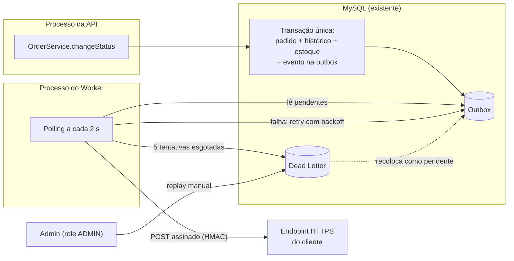

# RFC-001 — Sistema de Webhooks de Notificação de Pedidos

## Metadados

| Campo | Valor |
| --- | --- |
| RFC | 001 |
| Título | Sistema de Webhooks de Notificação de Pedidos |
| Autora | Larissa (Tech Lead) |
| Status | **Em revisão** |
| Data | 28/09/2026 (elaborada a partir da reunião técnica de quinta-feira, 09:00) |
| Revisores | Marcos (Product Manager), Bruno (Engenheiro Pleno, time de Pedidos), Diego (Engenheiro Sênior, time de Plataforma), Sofia (Engenheira de Segurança) |
| Decisões registradas | [ADR-001](adrs/ADR-001-outbox-no-mysql.md) a [ADR-006](adrs/ADR-006-reuso-dos-padroes-existentes.md) |
| Documentos relacionados | [Ata da reunião](levantamento-tecnico/ATA-REUNIAO-WEBHOOKS.md), [Levantamento técnico do código](levantamento-tecnico/LEVANTAMENTO-TECNICO.md), [PRD](PRD.md) e [FDD](FDD.md) (em elaboração) |

---

## Resumo executivo (TL;DR)

- **Problema:** clientes B2B precisam saber em até 10 segundos quando o status dos seus pedidos muda. Hoje fazem polling em `GET /orders`, o que é lento e caro, e um deles ameaça migrar para a concorrência.
- **Proposta:** **webhooks de saída** publicados pelo **padrão Outbox no MySQL**. O evento é gravado na mesma transação da mudança de status, e um **worker em processo separado**, com **polling de 2 s**, faz a entrega HTTP.
- **Resiliência:** **5 tentativas com backoff exponencial** (1m, 5m, 30m, 2h, 12h). Esgotadas as tentativas, o evento vai para uma **DLQ em tabela separada**, com **replay manual restrito a ADMIN**.
- **Segurança:** **HMAC-SHA256** sobre o corpo, **secret única por endpoint**, **rotação com 24 h de convivência** e **HTTPS obrigatório**.
- **Garantia:** entrega **at-least-once**, com `X-Event-Id` para deduplicação no cliente. A ordem é garantida por pedido, com worker único.
- **Escopo e prazo:** sem nova infraestrutura; reuso total dos padrões do OMS. E-mail de alerta, dashboard e rate limiting ficam fora desta fase. Estimativa de **3 sprints**, incluindo revisão de segurança.

---

## Contexto e problema

Três clientes B2B (Atlas Comercial, MaxDistribuição e Nova Cargo) pediram formalmente para serem notificados quando o status dos seus pedidos muda. Hoje eles consultam `GET /orders` periodicamente para detectar mudanças, o que deixa a integração lenta e cara para eles. Para esses clientes, qualquer latência **abaixo de 10 segundos** é considerada "tempo real". A Atlas sinalizou que pode migrar para um concorrente se a solução não for entregue, e pediu a entrega até o fim de novembro.

Do lado técnico:

- **O OMS não tem nenhum mecanismo de eventos, filas, jobs ou notificação externa.** Tudo acontece de forma síncrona no ciclo request/response.
- **A mudança de status é o ponto de origem natural do evento**, e ela já é uma operação transacional relativamente pesada. O método `changeStatus` ([src/modules/orders/order.service.ts](../src/modules/orders/order.service.ts)) valida a máquina de estados, atualiza o pedido, grava o histórico de status e, conforme a transição, movimenta o estoque, tudo dentro de `prisma.$transaction`.
- **O time é pequeno** e não quer operar infraestrutura adicional.

**Objetivos**

- Notificar o cliente de cada mudança de status de pedido que ele assinar, em menos de 10 s.
- Garantir que nenhuma mudança de status fique sem o evento correspondente.
- Permitir que o cliente verifique a autenticidade e a integridade das notificações.
- Dar ao cliente autonomia para gerenciar seus webhooks e acompanhar as entregas via API.

**Não objetivos**

- Receber eventos dos clientes (webhooks de entrada).
- Garantir entrega exatamente uma vez (exactly-once) ou ordenação global de eventos.
- Oferecer interface visual para gestão dos webhooks.

---

## Proposta técnica

### Visão geral

### Componentes

**1. Outbox transacional no MySQL** ([ADR-001](adrs/ADR-001-outbox-no-mysql.md))
Quando o status de um pedido muda, o evento é gravado numa tabela de outbox **dentro da mesma transação** que já atualiza o pedido e o histórico. Se a transação confirma, o evento existe; se desfaz, o evento some junto. O evento é gravado já renderizado (snapshot do momento da transição) e só é criado se algum webhook do cliente assinar aquele status. A publicação acontece por uma função que recebe o contexto da transação corrente, chamada a partir de `changeStatus`.

**2. Worker em processo separado** ([ADR-002](adrs/ADR-002-worker-separado-com-polling.md))
Um novo processo Node, com entry-point próprio ao lado da API, consulta a outbox a cada 2 segundos, pega os eventos pendentes mais antigos em pequenos lotes e faz a entrega HTTP. Ele usa o mesmo banco e a mesma stack, com sua própria conexão Prisma. Rodar fora da API garante que reinícios e deploys de um não interrompam o outro. Nesta fase há **um único worker**, o que preserva a ordem dos eventos de cada pedido.

**3. Retry e Dead Letter Queue** ([ADR-003](adrs/ADR-003-retry-backoff-exponencial-e-dlq.md))
Uma entrega que falha, incluindo o caso de o cliente não responder em 10 s, é reagendada com backoff exponencial (1m, 5m, 30m, 2h, 12h), o que cobre cerca de 15 horas de indisponibilidade. Depois disso, o evento vai para uma tabela de dead letter, com o payload e o motivo da falha. Um administrador pode reenfileirar o evento manualmente; a ação exige a role ADMIN e fica registrada para auditoria.

**4. Entrega autenticada** ([ADR-004](adrs/ADR-004-hmac-sha256-secret-por-endpoint.md))
Cada webhook cadastrado recebe uma secret própria, gerada pela plataforma. Toda entrega é assinada com HMAC-SHA256 sobre o corpo (header `X-Signature`) e leva o momento do envio (`X-Timestamp`), para o cliente poder rejeitar reenvios antigos. A secret pode ser rotacionada pela API, com a anterior válida por mais 24 horas. Só são aceitas URLs HTTPS.

**5. Garantia de entrega** ([ADR-005](adrs/ADR-005-entrega-at-least-once-com-x-event-id.md))
A plataforma garante **at-least-once**. Cada evento carrega um identificador único (`X-Event-Id`) gerado ao entrar na outbox, e o cliente usa esse identificador para descartar duplicatas. A regra será documentada em destaque no portal do desenvolvedor.

**6. API de gestão e aderência ao projeto** ([ADR-006](adrs/ADR-006-reuso-dos-padroes-existentes.md))
Um novo módulo `webhooks`, com a mesma estrutura dos módulos existentes, expõe as capacidades de:

- cadastrar, editar, remover e listar os webhooks de um cliente, escolhendo os status de interesse;
- consultar o histórico de entregas de um webhook;
- rotacionar a secret;
- reprocessar eventos da dead letter (somente ADMIN).

Erros seguem a hierarquia `AppError`, com códigos prefixados por `WEBHOOK_`, e passam pelo error middleware atual. Os logs usam o Pino existente e a autorização usa o `requireRole` já disponível.

### Garantias e limites da solução

| Aspecto | Compromisso |
| --- | --- |
| Latência | Intervalo de polling de 2 s, bem abaixo do teto de 10 s esperado pelos clientes |
| Consistência | Toda mudança de status com assinatura ativa gera evento (mesma transação) |
| Entrega | At-least-once; deduplicação pelo cliente via `X-Event-Id` |
| Ordenação | Por pedido, enquanto houver um único worker; sem ordenação global |
| Resiliência | Até 5 tentativas em ~15 h; depois, DLQ com replay manual |
| Timeout por entrega | 10 s |
| Tamanho do evento | Máximo de 64 KB; acima disso é erro, sem truncamento |
| Transporte | HTTPS obrigatório |

Formato do payload, contratos dos endpoints, modelagem das tabelas e matriz de erros ficam para o [FDD](FDD.md).

---

## Alternativas consideradas

Todas as alternativas abaixo foram colocadas na mesa durante a reunião e descartadas.

| # | Alternativa | Trade-off que levou ao descarte | Decisão |
| --- | --- | --- | --- |
| 1 | **Disparo síncrono** do webhook dentro de `changeStatus` | Mais simples, mas acopla a transação de status à latência e à disponibilidade do cliente: um cliente lento trava mudanças de outros pedidos, e não há como desfazer o status se o cliente estiver fora do ar | [ADR-001](adrs/ADR-001-outbox-no-mysql.md) |
| 2 | **Fila externa (Redis Streams)** | Mecanismo dedicado e mais reativo, mas exige subir e operar infraestrutura nova, o que foi considerado overengineering para um time pequeno. Também não participa da transação do MySQL | [ADR-001](adrs/ADR-001-outbox-no-mysql.md) |
| 3 | **Trigger de banco** para acordar o worker | Reagiria na hora, mas o MySQL não notifica processos externos (não há equivalente ao `NOTIFY/LISTEN` do Postgres); exigiria improvisos. O polling de 2 s já atende a latência | [ADR-002](adrs/ADR-002-worker-separado-com-polling.md) |
| 4 | **Worker dentro do processo da API** | Um processo a menos para operar, mas o worker seria interrompido a cada reinício da API | [ADR-002](adrs/ADR-002-worker-separado-com-polling.md) |
| 5 | **Retry indefinido** | Nenhum evento seria abandonado, mas eventos de clientes que sumiram ficariam pendurados para sempre | [ADR-003](adrs/ADR-003-retry-backoff-exponencial-e-dlq.md) |
| 6 | **Apenas 3 tentativas** | Identifica falhas mais cedo, mas esgotaria em cerca de 30 minutos, menos que manutenções de 2 h já vistas em clientes | [ADR-003](adrs/ADR-003-retry-backoff-exponencial-e-dlq.md) |
| 7 | **DLQ como status "failed" na própria outbox** | Uma tabela a menos, mas mistura eventos mortos com a fila ativa que o worker lê continuamente e dificulta a análise | [ADR-003](adrs/ADR-003-retry-backoff-exponencial-e-dlq.md) |
| 8 | **Secret global da plataforma** | Gestão mais simples, mas o vazamento de uma única secret comprometeria todos os clientes | [ADR-004](adrs/ADR-004-hmac-sha256-secret-por-endpoint.md) |
| 9 | **Exactly-once** | O cliente não precisaria deduplicar, mas exigiria coordenação entre os dois lados e complexidade muito maior | [ADR-005](adrs/ADR-005-entrega-at-least-once-com-x-event-id.md) |
| 10 | **`customer_id` extraído do JWT** | Evitaria informar o cliente na requisição, mas o JWT atual identifica o usuário interno, não o cliente | [ADR-006](adrs/ADR-006-reuso-dos-padroes-existentes.md) |

---

## Questões em aberto

### Adiadas ou em observação

| # | Questão | Situação |
| --- | --- | --- |
| Q1 | **Rate limiting de envio** por cliente (ex.: muitos pedidos mudando de status em um minuto) | Fora desta fase. Observar o comportamento em produção e implementar se virar problema |
| Q2 | **Alerta por e-mail** ao cliente quando o webhook falha repetidamente | Adiado para a próxima fase, depois de medir o impacto |
| Q3 | **Escala para múltiplos workers** | Não agora. Quando necessário, avaliar particionamento por pedido ou lock pessimista, preservando a ordem por pedido |
| Q4 | **Permissões do CRUD de configuração** | Nesta fase, qualquer usuário autenticado; restringir numa fase futura |

### Levantadas e não decididas

| # | Questão | O que falta decidir |
| --- | --- | --- |
| Q5 | Identificação do cliente nas rotas de configuração | Se o `customer_id` vai no corpo ou no caminho da requisição |
| Q6 | Conteúdo do evento | Quais "campos básicos do pedido" entram além do valor total |
| Q7 | Contagem de tentativas | Se as 5 tentativas incluem o envio inicial ou são 5 reenvios após a primeira falha (foram definidos 5 intervalos) |
| Q8 | Histórico de entregas | Se a consulta se limita às últimas 100 entregas ou é paginada |

Pontos não discutidos na reunião, que o FDD precisa fechar: como a assinatura funciona durante as 24 h de convivência de duas secrets; quais respostas HTTP do cliente contam como sucesso; e como recuperar eventos presos em processamento se o worker cair. A lista completa está na seção 14 da [ata](levantamento-tecnico/ATA-REUNIAO-WEBHOOKS.md).

---

## Impacto e riscos

### Impacto

| Área | Impacto |
| --- | --- |
| **Fluxo de pedidos** | `changeStatus` ganha uma escrita adicional na mesma transação; uma falha nela desfaz a mudança de status (preferível a status sem evento) |
| **Arquitetura** | Surge um segundo processo (worker) e novas tabelas (configuração de webhooks, outbox, dead letter); novo módulo registrado no composition root ([src/app.ts](../src/app.ts)) e no agregador de rotas ([src/routes/index.ts](../src/routes/index.ts)) |
| **Banco de dados** | Consultas periódicas do worker e crescimento contínuo da outbox; o arquivamento de eventos antigos não faz parte desta entrega |
| **Operação** | Dois processos para implantar e monitorar; a DLQ precisa de acompanhamento para acionar o replay |
| **Clientes** | Precisam expor endpoint HTTPS, verificar a assinatura HMAC e deduplicar por `X-Event-Id` |
| **Prazo** | Estimativa de 3 sprints: outbox e DLQ (1), worker e retry (1), CRUD e histórico (½), integração e testes ponta a ponta (½), mais HMAC e validações, com a revisão de segurança incluída no fim |

### Riscos

| Risco | Mitigação |
| --- | --- |
| Perda do cliente Atlas por atraso | Prazo de 3 sprints alinhado ao fim de novembro; Produto confirma o prazo com o cliente |
| Cliente lento travando mudanças de status | Entrega assíncrona via outbox e worker |
| Status alterado sem evento correspondente | Evento gravado na mesma transação, com rollback conjunto |
| Acúmulo de eventos degradando o worker | Índices por status e data; leitura em lotes pequenos; arquivamento como evolução futura |
| Vazamento de secret | Secret por endpoint; rotação com 24 h de convivência; redaction nos logs |
| Requisição falsificada ou adulterada | HMAC-SHA256 e HTTPS obrigatório |
| Reenvio malicioso de requisições antigas | `X-Timestamp` para validação no cliente |
| Cliente processando evento duplicado | `X-Event-Id` e documentação em destaque no portal do desenvolvedor |
| Indisponibilidade prolongada do cliente | Janela de retry de ~15 h, DLQ e replay manual |
| Volume alto de chamadas a um mesmo cliente | Observar em produção; rate limiting como evolução |
| Evento anormalmente grande | Limite de 64 KB, com erro |
| Falha de segurança em HMAC ou na geração de secret | Revisão de segurança de pelo menos 2 dias úteis antes do deploy |

---

## Fora de escopo

- Webhooks de entrada (clientes enviando eventos para a plataforma).
- Alerta por e-mail em falhas repetidas (próxima fase).
- Dashboard ou painel visual (projeto separado do time de frontend).
- Arquivamento de eventos entregues.
- Entrega exactly-once e ordenação global.

---

## Decisões relacionadas

| ADR | Decisão |
| --- | --- |
| [ADR-001](adrs/ADR-001-outbox-no-mysql.md) | Padrão Outbox no MySQL para publicação de eventos de webhook |
| [ADR-002](adrs/ADR-002-worker-separado-com-polling.md) | Worker em processo separado com polling de 2 segundos |
| [ADR-003](adrs/ADR-003-retry-backoff-exponencial-e-dlq.md) | Retry com backoff exponencial e Dead Letter Queue em tabela separada |
| [ADR-004](adrs/ADR-004-hmac-sha256-secret-por-endpoint.md) | Autenticação das entregas com HMAC-SHA256 e secret por endpoint |
| [ADR-005](adrs/ADR-005-entrega-at-least-once-com-x-event-id.md) | Garantia de entrega at-least-once com `X-Event-Id` para deduplicação |
| [ADR-006](adrs/ADR-006-reuso-dos-padroes-existentes.md) | Reuso dos padrões existentes do projeto no módulo de webhooks |

---

## Próximos passos

1. Sessão de revisão desta RFC com Bruno e Diego antes do início da implementação.
2. Consolidar os comentários dos revisores e fechar as questões Q5 a Q8.
3. Detalhar a implementação no [FDD](FDD.md) (contratos, modelagem, fluxos, matriz de erros, observabilidade).
4. Agendar a revisão de segurança com Sofia (mínimo de 2 dias úteis) antes do deploy.
