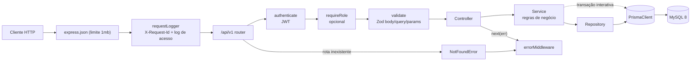
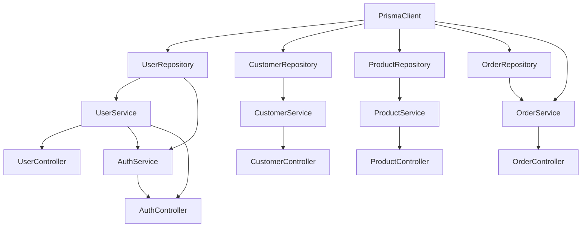
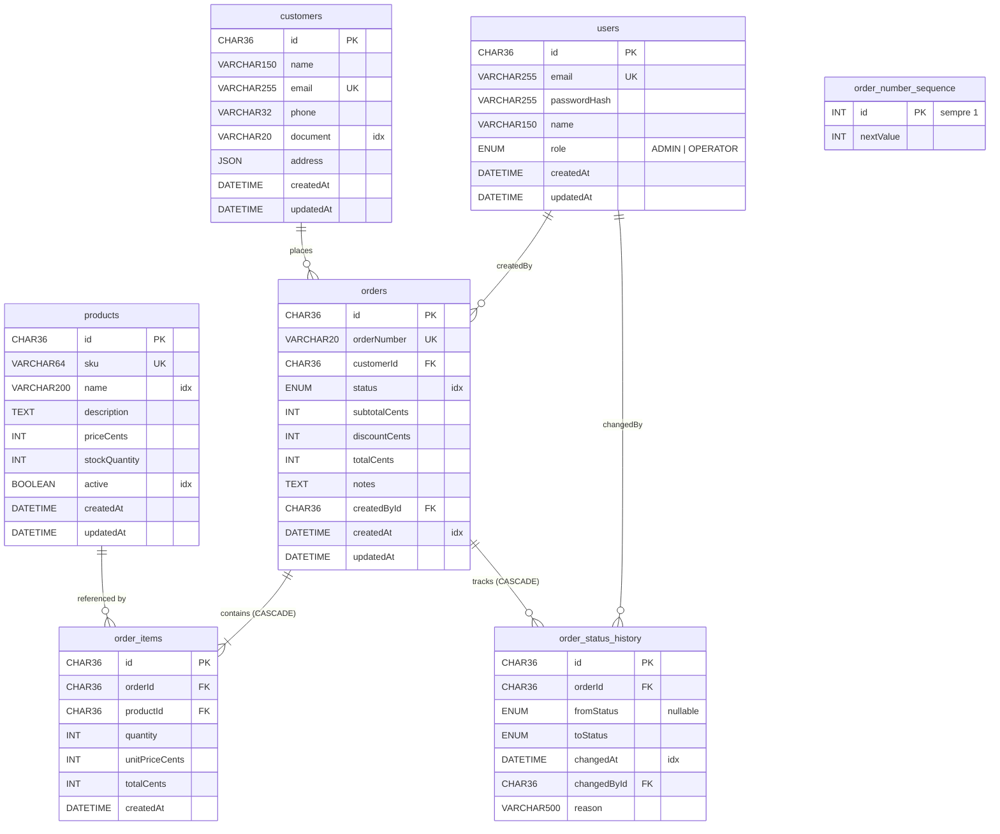
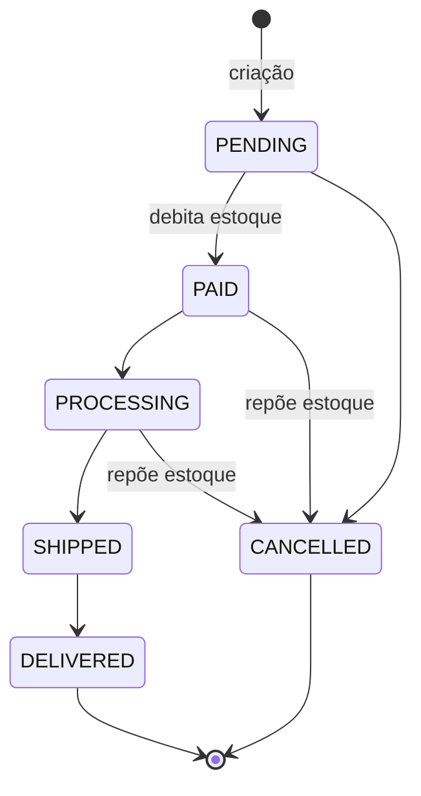
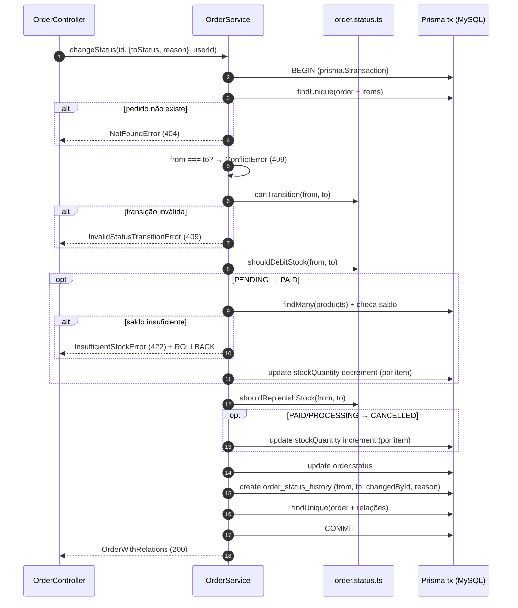
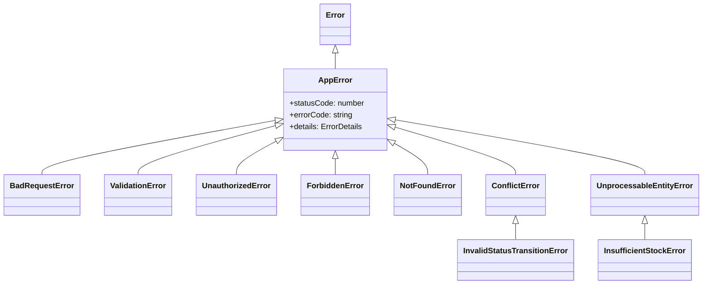
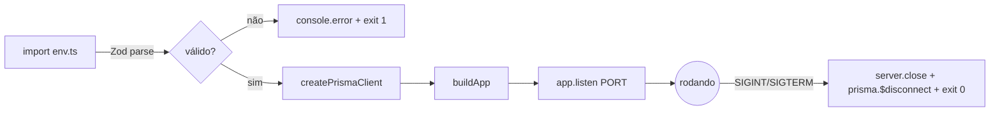

# Levantamento Técnico do Código — Order Management API (OMS)

> **Escopo deste documento:** mapear a estrutura, a arquitetura, os padrões, o modelo de implementação, os frameworks e as bibliotecas da aplicação existente, e registrar a percepção geral sobre a base de código. O foco é **entender e contextualizar**, não auditar: débitos técnicos, bugs e anti-patterns estão deliberadamente fora do escopo.
>
> **Base analisada:** `src/`, `prisma/`, `tests/` e arquivos de configuração da raiz. Todos os caminhos citados existem no repositório.
>
> **Data do levantamento:** 27/09/2026

---

## Sumário

1. [Visão geral](#1-visão-geral)
2. [Stack: frameworks e bibliotecas](#2-stack-frameworks-e-bibliotecas)
3. [Estrutura de diretórios](#3-estrutura-de-diretórios)
4. [Arquitetura](#4-arquitetura)
5. [Modelo de implementação por camada](#5-modelo-de-implementação-por-camada)
6. [Padrões de projeto identificados](#6-padrões-de-projeto-identificados)
7. [Modelo de dados](#7-modelo-de-dados)
8. [Domínio de pedidos: máquina de estados, estoque e auditoria](#8-domínio-de-pedidos-máquina-de-estados-estoque-e-auditoria)
9. [Contratos HTTP](#9-contratos-http)
10. [Tratamento de erros](#10-tratamento-de-erros)
11. [Autenticação e autorização](#11-autenticação-e-autorização)
12. [Observabilidade](#12-observabilidade)
13. [Configuração, build e execução](#13-configuração-build-e-execução)
14. [Estratégia de testes](#14-estratégia-de-testes)
15. [Convenções de código](#15-convenções-de-código)
16. [Pontos de extensão relevantes para a feature de Webhooks](#16-pontos-de-extensão-relevantes-para-a-feature-de-webhooks)
17. [Percepção geral](#17-percepção-geral)

---

## 1. Visão geral

A aplicação é uma **API REST de gestão de pedidos** (`order-management-api`, ver [package.json](../../package.json)) escrita em **Node.js + TypeScript**, com persistência em **MySQL 8** via **Prisma ORM**. Ela cobre cinco domínios:

| Domínio | Responsabilidade |
| --- | --- |
| `auth` | Registro, login (emissão de JWT) e consulta do usuário autenticado |
| `users` | Consulta de usuários internos (operadores e administradores) |
| `customers` | CRUD de clientes (pessoa física ou jurídica, com endereço em JSON) |
| `products` | CRUD de produtos (SKU, preço em centavos, estoque, flag de ativo) |
| `orders` | Criação de pedidos, ciclo de vida por máquina de estados, controle de estoque e histórico de status |

Números da base:

| Item | Quantidade |
| --- | --- |
| Linhas de código em `src/` | ~1.700 |
| Linhas de teste em `tests/` | ~400 |
| Módulos de domínio | 5 |
| Tabelas no banco | 7 |
| Endpoints HTTP (incluindo `/health`) | 20 |

O módulo `orders` concentra quase 30% do código (≈480 linhas) e é o núcleo de regras de negócio. Os demais módulos são CRUDs enxutos que seguem o mesmo molde.

A aplicação **não possui** nenhum mecanismo de mensageria, eventos, filas, jobs em background ou notificação externa. Tudo acontece de forma síncrona dentro do ciclo request/response.

---

## 2. Stack: frameworks e bibliotecas

### 2.1 Runtime e linguagem

| Tecnologia | Versão | Observação |
| --- | --- | --- |
| Node.js | `>= 20` | Usa o flag nativo `--env-file` para carregar `.env` (sem `dotenv`) |
| TypeScript | 5.6.3 | `strict`, `noUncheckedIndexedAccess`, `noImplicitOverride`, `isolatedModules` |
| Módulos | ESM (`"type": "module"`) | Imports internos com sufixo `.js`; `moduleResolution: Bundler`; alvo ES2022 |

### 2.2 Dependências de produção

| Biblioteca | Versão | Papel no projeto | Onde é usada |
| --- | --- | --- | --- |
| **express** | 4.21.1 | Framework HTTP: roteamento, middlewares, handlers | `src/app.ts`, `src/modules/*/*.routes.ts` |
| **@prisma/client** | 5.22.0 | ORM / query builder tipado, transações | `src/config/database.ts`, repositórios, `order.service.ts` |
| **zod** | 3.23.8 | Validação de env, body, query e params; inferência de tipos | `src/config/env.ts`, `src/modules/*/*.schemas.ts` |
| **jsonwebtoken** | 9.0.2 | Assinatura e verificação de JWT | `auth.service.ts`, `auth.middleware.ts` |
| **bcrypt** | 5.1.1 | Hash de senha (10 rounds) | `user.service.ts`, `auth.service.ts`, seed, testes |
| **pino** | 9.5.0 | Logger estruturado em JSON | `src/shared/logger/index.ts` |
| **pino-http** | 10.3.0 | Declarada como dependência; o log de requisições é feito por middleware próprio | — |
| **uuid** | 11.0.3 | Geração de `X-Request-Id` | `request-logger.middleware.ts` |

### 2.3 Dependências de desenvolvimento

| Biblioteca | Versão | Papel |
| --- | --- | --- |
| **prisma** (CLI) | 5.22.0 | Migrations, geração do client, seed |
| **tsx** | 4.19.2 | Execução de TS direto em dev (`watch`) e do seed |
| **vitest** | 2.1.4 | Test runner |
| **supertest** | 7.0.0 | Requisições HTTP contra a instância Express nos testes |
| **pino-pretty** | 11.3.0 | Formatação legível dos logs em `development` |
| **eslint** 8 + **@typescript-eslint** 8 | — | Lint com regras de tipagem |
| **eslint-config-prettier** + **prettier** 3 | — | Formatação padronizada |
| `@types/*` | — | Tipagens de express, node, bcrypt, jsonwebtoken, supertest, uuid |

### 2.4 Infraestrutura

| Componente | Definição |
| --- | --- |
| **MySQL 8.0** | [docker-compose.yml](../../docker-compose.yml): container `oms-mysql`, charset `utf8mb4`, collation `utf8mb4_unicode_ci`, healthcheck via `mysqladmin ping`, volume nomeado `oms_mysql_data` |
| **Shadow database** | `SHADOW_DATABASE_URL` configurada em `prisma/schema.prisma` para o `prisma migrate dev` |

Não há Redis, broker de mensagens, cache, APM ou qualquer outro serviço externo.

---

## 3. Estrutura de diretórios

```
.
├── prisma/
│   ├── schema.prisma               # Modelo de dados (fonte da verdade do schema)
│   ├── seed.ts                     # Popula usuários, clientes, produtos e 26 pedidos
│   └── migrations/
│       └── 20260519182739_init/    # Migration inicial (DDL completo)
├── src/
│   ├── server.ts                   # Entry-point: bootstrap + graceful shutdown
│   ├── app.ts                      # App factory + composition root (DI manual)
│   ├── config/
│   │   ├── env.ts                  # Validação de variáveis de ambiente com Zod
│   │   └── database.ts             # Factory e instância singleton do PrismaClient
│   ├── routes/
│   │   └── index.ts                # Agrega os routers de cada módulo em /api/v1
│   ├── middlewares/
│   │   ├── auth.middleware.ts      # authenticate (JWT) e requireRole (RBAC)
│   │   ├── validate.middleware.ts  # Validação genérica com schemas Zod
│   │   ├── error.middleware.ts     # Handler de erros centralizado
│   │   └── request-logger.middleware.ts  # Request ID + log de acesso
│   ├── shared/
│   │   ├── errors/                 # AppError + hierarquia de erros HTTP/domínio
│   │   ├── http/response.ts        # Envelope de paginação
│   │   └── logger/index.ts         # Instância Pino configurada
│   └── modules/
│       ├── auth/        (controller, routes, schemas, service)
│       ├── users/       (controller, repository, routes, schemas, service)
│       ├── customers/   (controller, repository, routes, schemas, service)
│       ├── products/    (controller, repository, routes, schemas, service)
│       └── orders/      (controller, repository, routes, schemas, service, status)
└── tests/
    ├── setup.ts                    # Conexão e limpeza do banco entre testes
    ├── helpers/factories.ts        # Fábricas de dados e helpers de autenticação
    ├── auth.test.ts
    └── orders.test.ts
```

A organização é **por feature (package-by-feature)** no nível de `src/modules`, e **por camada técnica** dentro de cada módulo. O código transversal (middlewares, erros, logger, paginação, config) fica fora dos módulos, em pastas compartilhadas.

---

## 4. Arquitetura

### 4.1 Estilo arquitetural

**Monólito modular em camadas.** Um único processo Node expõe toda a API. Cada domínio vive em um módulo isolado com as mesmas camadas, e os módulos se comunicam apenas por injeção de dependência resolvida no composition root (`src/app.ts`). Não há acoplamento direto entre módulos, com uma exceção intencional: `auth` reutiliza `UserRepository` e `UserService` do módulo `users`.

### 4.2 Fluxo de uma requisição



### 4.3 Camadas e responsabilidades

| Camada | Arquivo típico | Responsabilidade | Conhece |
| --- | --- | --- | --- |
| **Routes** | `*.routes.ts` | Define verbos, caminhos e a cadeia de middlewares | Controller, schemas, middlewares |
| **Schemas** | `*.schemas.ts` | Contratos de entrada (Zod) e tipos inferidos | Zod |
| **Controller** | `*.controller.ts` | Adapta HTTP → service: extrai `params`/`body`/`query`/`req.user`, escolhe status code | Service |
| **Service** | `*.service.ts` | Regras de negócio, validações de unicidade, orquestração, transações | Repository, erros de domínio, (em `orders`) PrismaClient |
| **Repository** | `*.repository.ts` | Acesso a dados via Prisma, montagem de filtros, paginação | PrismaClient |

### 4.4 Composition root e injeção de dependência

`buildControllers(prisma)` em [src/app.ts](../../src/app.ts) instancia manualmente o grafo de objetos:



Não há container de DI (InversifyJS, tsyringe etc.): a injeção é **por construtor**, com dependências declaradas como `private readonly`. `buildApp({ prisma })` recebe o `PrismaClient` de fora, o que permite que `server.ts` e os testes montem a aplicação com a mesma função.

### 4.5 Separação entre app e servidor

| Arquivo | Papel |
| --- | --- |
| `src/app.ts` | Constrói e devolve a instância `Express` **sem** chamar `listen`. Registra middlewares globais, `/health`, o router versionado, o fallback 404 e o error middleware. |
| `src/server.ts` | Chama `buildApp`, sobe o servidor na porta de `env.PORT`, registra handlers de `SIGINT`/`SIGTERM` (fecha o servidor HTTP e desconecta o Prisma) e loga `bootstrap_failed` em caso de falha na inicialização. |

Essa separação é o que permite aos testes usarem `supertest` diretamente sobre a app, sem abrir porta.

---

## 5. Modelo de implementação por camada

### 5.1 Routes: factories de router

Cada módulo exporta uma função `buildXRouter(controller): Router`. A autenticação é aplicada ao router inteiro com `router.use(authenticate)` (customers, products, orders) ou por rota (auth, users). A validação é declarada por rota:

```ts
// src/modules/orders/order.routes.ts
router.use(authenticate);
router.patch(
  '/:id/status',
  validate({ params: orderIdParamSchema, body: updateOrderStatusSchema }),
  controller.changeStatus,
);
```

`src/routes/index.ts` agrega os routers sob os prefixos `/auth`, `/users`, `/customers`, `/products` e `/orders`, e `app.ts` monta tudo em `/api/v1`.

### 5.2 Schemas: Zod como fonte única de contrato e tipo

Cada módulo define schemas para `body`, `query` e `params`, e **deriva os tipos TypeScript** com `z.infer`:

```ts
export const createOrderSchema = z.object({
  customerId: z.string().uuid(),
  items: z.array(orderItemInputSchema).min(1, 'order must contain at least one item'),
  discountCents: z.number().int().nonnegative().default(0),
  notes: z.string().max(1000).optional(),
});
export type CreateOrderInput = z.infer<typeof createOrderSchema>;
```

Técnicas recorrentes:

| Técnica | Exemplo |
| --- | --- |
| Coerção de query string | `z.coerce.number()` para `page`/`pageSize`; `z.coerce.date()` para `from`/`to` |
| Defaults | `page = 1`, `pageSize = 20` (máx. 100), `role = 'OPERATOR'`, `active = true` |
| Update parcial derivado do create | `updateCustomerSchema = createCustomerSchema.partial()` |
| Enum do Prisma reaproveitado | `z.nativeEnum(OrderStatus)` |
| Transformação | `active: 'true' \| 'false'` → `boolean` em `listProductsQuerySchema` |
| Objeto aninhado | `addressSchema` dentro de `createCustomerSchema` |

### 5.3 Middleware de validação

[src/middlewares/validate.middleware.ts](../../src/middlewares/validate.middleware.ts) recebe `{ body?, query?, params? }`, faz `parse` de cada fonte, **substitui** `req.body`/`req.params` pelos valores já tipados e coeridos (em `req.query` usa `Object.assign`), e converte `ZodError` em `ValidationError` com `details` no formato `[{ path, message }]`.

### 5.4 Controllers: handlers como propriedades arrow

Controllers são classes cujos métodos são **propriedades do tipo `RequestHandler` definidas com arrow function**. Isso preserva o `this` quando o handler é passado por referência ao router (`controller.list`), sem precisar de `.bind`. Todo handler segue o mesmo molde:

```ts
list: RequestHandler = async (req, res, next) => {
  try {
    const query = req.query as unknown as ListOrdersQuery;
    const result = await this.orders.list(query);
    res.status(200).json(result);
  } catch (err) {
    next(err);
  }
};
```

Status codes usados: `200` (leitura/atualização), `201` (criação), `204` (remoção, sem corpo).

### 5.5 Services: regras de negócio e mapeamento

- Verificam existência antes de atualizar/remover (`await this.getById(id)`) e lançam `NotFoundError`.
- Verificam unicidade de negócio antes do insert (e-mail de usuário/cliente, SKU de produto) e lançam `ConflictError` com código específico (`EMAIL_ALREADY_USED`, `SKU_ALREADY_USED`).
- Montam updates parciais com spread condicional (`...(input.name !== undefined ? { name: input.name } : {})`), enviando ao banco somente os campos informados.
- Convertem `page`/`pageSize` em `skip`/`take` e devolvem o envelope `paginated(...)`.
- `UserService.toPublic(user)` é um **mapper estático** que remove `passwordHash` antes de qualquer resposta.
- `OrderService` é o único service que recebe o `PrismaClient` diretamente, porque orquestra **transações interativas** envolvendo várias tabelas.

### 5.6 Repositories: encapsulamento do Prisma

- Recebem `PrismaClient` no construtor.
- Expõem métodos com nomes de intenção: `findById`, `findByEmail`, `findBySku`, `findManyByIds`, `findByIdWithRelations`, `list`, `create`, `update`, `delete`.
- Montam o `where` em um método privado `buildWhere(filters)` que retorna o tipo gerado pelo Prisma (`Prisma.OrderWhereInput` etc.).
- A listagem executa `findMany` e `count` juntos em `prisma.$transaction([...])` (transação em lote), garantindo que itens e total venham do mesmo snapshot.
- Busca textual com `contains` em múltiplas colunas via `OR` (nome/e-mail/documento em clientes; nome/SKU em produtos).
- `OrderRepository` define o tipo `OrderWithRelations` para a projeção detalhada (itens com produto resumido, histórico ordenado por `changedAt`, cliente resumido).

---

## 6. Padrões de projeto identificados

| Padrão | Onde | Como aparece |
| --- | --- | --- |
| **Layered Architecture** | Todos os módulos | routes → controller → service → repository |
| **Modular Monolith / Package-by-feature** | `src/modules/*` | Um diretório por domínio, com os mesmos arquivos |
| **Repository** | `*.repository.ts` | Isola o Prisma do restante da aplicação |
| **Service Layer** | `*.service.ts` | Centraliza regras de negócio e orquestração |
| **Dependency Injection (constructor)** | Todas as classes | Dependências `private readonly` no construtor |
| **Composition Root** | `buildControllers` em `src/app.ts` | Único ponto que conhece o grafo completo de objetos |
| **Factory Function** | `buildApp`, `buildXRouter`, `createPrismaClient`, `createLogger` | Construção de objetos configurados, sem `new` espalhado |
| **Singleton de módulo** | `prisma`, `logger`, `env` | Instâncias exportadas e compartilhadas no processo |
| **Chain of Responsibility (middlewares)** | Express | `authenticate` → `requireRole` → `validate` → handler |
| **Higher-order middleware** | `requireRole(...roles)`, `validate(schemas)` | Funções que recebem configuração e devolvem um `RequestHandler` |
| **Centralized Error Handling** | `error.middleware.ts` | Um único handler traduz exceções em respostas HTTP |
| **Exception hierarchy** | `src/shared/errors/` | `AppError` → erros HTTP → erros de domínio |
| **Schema-first validation / type inference** | `*.schemas.ts` | Zod define contrato e tipo ao mesmo tempo |
| **DTO / Mapper** | `UserService.toPublic` | Projeção pública sem campos sensíveis |
| **State Machine (tabela de transições)** | `order.status.ts` | `Record<OrderStatus, OrderStatus[]>` + funções puras |
| **Unit of Work (transação interativa)** | `OrderService.create` e `changeStatus` | `prisma.$transaction(async (tx) => ...)` |
| **Audit Log / Histórico** | `order_status_history` | Cada transição registra origem, destino, autor e motivo |
| **Sequence table** | `order_number_sequence` | Numeração humana `ORD-000001` via `upsert` + `increment` |
| **Snapshot de preço** | `OrderItem.unitPriceCents` | Preço copiado do produto no momento da criação |
| **Money as integer cents** | Todos os valores monetários | `priceCents`, `subtotalCents`, `discountCents`, `totalCents` |
| **Envelope de resposta** | `shared/http/response.ts`, error middleware | `{ data, pagination }` e `{ error: { code, message, details? } }` |
| **Fail-fast configuration** | `src/config/env.ts` | Valida env com Zod na importação e encerra o processo se inválido |
| **Graceful shutdown** | `src/server.ts` | `SIGINT`/`SIGTERM` fecham HTTP e desconectam o Prisma |
| **Correlation ID** | `request-logger.middleware.ts` | Reaproveita `X-Request-Id` recebido ou gera UUID, devolve no header |
| **Module augmentation** | `auth.middleware.ts` | Estende `Request` do Express com `user` e `id` tipados |
| **Test Data Builder / Factory** | `tests/helpers/factories.ts` | `createTestUser`, `createTestProduct`, overrides parciais |

---

## 7. Modelo de dados

### 7.1 Diagrama entidade-relacionamento



### 7.2 Convenções do schema

| Convenção | Detalhe |
| --- | --- |
| Chaves primárias | UUID v4 gerado pelo Prisma (`@default(uuid())`), armazenado como `CHAR(36)` |
| Nomes de tabela | `snake_case` no plural via `@@map` (`order_status_history`); models em PascalCase no singular |
| Nomes de coluna | `camelCase` (iguais aos campos do model) |
| Timestamps | `createdAt @default(now())` e `updatedAt @updatedAt` com precisão de milissegundos (`DATETIME(3)`) |
| Enums | Nativos do MySQL (`ENUM(...)`), espelhados como enums TypeScript pelo Prisma Client |
| Dinheiro | Inteiros em centavos (`Int`) |
| Dados semiestruturados | `address` como coluna `JSON` |
| Integridade referencial | `RESTRICT` por padrão; `CASCADE` de `orders` para `order_items` e `order_status_history` |
| Índices | Em todas as FKs e nos campos de filtro/ordenação (`status`, `createdAt`, `active`, `name`, `document`, `changedAt`) |
| Charset | `utf8mb4` / `utf8mb4_unicode_ci` em todas as tabelas |

### 7.3 Migrations e seed

- Uma única migration (`20260519182739_init`) cria todo o schema.
- [prisma/seed.ts](../../prisma/seed.ts) limpa as tabelas em ordem de dependência e cria: 2 usuários (`admin@oms.local` / ADMIN e `operador@oms.local` / OPERATOR), 10 clientes brasileiros (CPF e CNPJ), 20 produtos de informática/escritório e 26 pedidos distribuídos entre todos os status, com histórico coerente com o caminho percorrido na máquina de estados.

---

## 8. Domínio de pedidos: máquina de estados, estoque e auditoria

### 8.1 Máquina de estados

Definida como tabela de transições imutável em [src/modules/orders/order.status.ts](../../src/modules/orders/order.status.ts):



Funções puras expostas pelo módulo:

| Função | Propósito |
| --- | --- |
| `canTransition(from, to)` | Valida se a transição é permitida |
| `allowedTransitions(from)` | Lista destinos possíveis a partir de um status |
| `isTerminal(status)` | `true` para `DELIVERED` e `CANCELLED` |
| `shouldDebitStock(from, to)` | `true` somente em `PENDING → PAID` (constante `STOCK_DEBIT_TRANSITION`) |
| `shouldReplenishStock(from, to)` | `true` em `PAID → CANCELLED` e `PROCESSING → CANCELLED` |

### 8.2 Criação de pedido (`OrderService.create`)

1. **Agrega itens duplicados** (mesmo `productId` somando quantidades) antes de tocar o banco.
2. Abre uma **transação interativa** e, dentro dela:
   - valida a existência do cliente (`NotFoundError('Customer')`);
   - busca todos os produtos de uma vez e valida existência (`NotFoundError('Product')`);
   - rejeita produtos inativos (`UnprocessableEntityError`, código `INACTIVE_PRODUCT`, com os SKUs);
   - calcula `unitPriceCents` (snapshot do preço atual), `totalCents` por item, `subtotalCents` e `totalCents`, **sempre no servidor**;
   - rejeita desconto maior que o subtotal (`ValidationError`);
   - reserva o próximo `orderNumber` na tabela de sequência;
   - cria `order` + `items` + primeira entrada de `history` (`null → PENDING`, motivo `"order created"`) em um único `create` aninhado;
   - retorna o pedido com relações.

A criação **não** mexe no estoque; a baixa acontece no pagamento.

### 8.3 Mudança de status (`OrderService.changeStatus`)

É o fluxo transacional mais importante da aplicação:



Características do modelo:

- **Atomicidade total**: estoque, status e histórico mudam juntos ou não mudam.
- **Validação de estoque em lote**: todos os itens sem saldo são reportados de uma vez em `details.unavailable[]` (`sku`, `requested`, `available`).
- **Operações atômicas de incremento/decremento** (`{ decrement: n }` / `{ increment: n }`) no próprio `UPDATE`.
- **Auditoria**: cada transição registra quem alterou (`changedById`, vindo do JWT) e o motivo opcional.

### 8.4 Remoção de pedido

Permitida somente em `PENDING` ou `CANCELLED`; nos demais status retorna `409` com código `INVALID_ORDER_STATE_FOR_DELETE`. Itens e histórico são removidos em cascata pelo banco.

### 8.5 Numeração de pedidos

`reserveOrderNumber(tx)` faz `upsert` na linha única (`id = 1`) de `order_number_sequence`, incrementando `nextValue`, e formata o valor como `ORD-` + 6 dígitos (`ORD-000042`). Como roda dentro da mesma transação da criação, o número só é consumido se o pedido for efetivamente criado.

---

## 9. Contratos HTTP

### 9.1 Endpoints

Prefixo: `/api/v1` (exceto `/health`).

| Método | Caminho | Autenticação | Role | Validação | Sucesso |
| --- | --- | --- | --- | --- | --- |
| GET | `/health` | — | — | — | 200 `{ status: "ok" }` |
| POST | `/auth/register` | — | — | body `registerSchema` | 201 `PublicUser` |
| POST | `/auth/login` | — | — | body `loginSchema` | 200 `{ user, tokens }` |
| GET | `/auth/me` | JWT | qualquer | — | 200 `PublicUser` |
| GET | `/users/:id` | JWT | **ADMIN** | params uuid | 200 `PublicUser` |
| GET | `/customers` | JWT | qualquer | query page/pageSize/search | 200 paginado |
| GET | `/customers/:id` | JWT | qualquer | params uuid | 200 |
| POST | `/customers` | JWT | qualquer | body | 201 |
| PATCH | `/customers/:id` | JWT | qualquer | params + body parcial | 200 |
| DELETE | `/customers/:id` | JWT | qualquer | params uuid | 204 |
| GET | `/products` | JWT | qualquer | query page/pageSize/search/active | 200 paginado |
| GET | `/products/:id` | JWT | qualquer | params uuid | 200 |
| POST | `/products` | JWT | qualquer | body | 201 |
| PATCH | `/products/:id` | JWT | qualquer | params + body parcial | 200 |
| DELETE | `/products/:id` | JWT | qualquer | params uuid | 204 |
| GET | `/orders` | JWT | qualquer | query page/pageSize/status/customerId/from/to | 200 paginado |
| GET | `/orders/:id` | JWT | qualquer | params uuid | 200 com items, history, customer |
| POST | `/orders` | JWT | qualquer | body `createOrderSchema` | 201 com relações |
| PATCH | `/orders/:id/status` | JWT | qualquer | params + body `{ toStatus, reason? }` | 200 com relações |
| DELETE | `/orders/:id` | JWT | qualquer | params uuid | 204 |

### 9.2 Formatos de resposta

**Listagem paginada** ([src/shared/http/response.ts](../../src/shared/http/response.ts)):

```json
{
  "data": [ { "...": "..." } ],
  "pagination": { "page": 1, "pageSize": 20, "total": 57, "totalPages": 3 }
}
```

**Login**:

```json
{
  "user": { "id": "…", "email": "…", "name": "…", "role": "OPERATOR", "createdAt": "…", "updatedAt": "…" },
  "tokens": { "accessToken": "eyJ…", "expiresIn": "8h", "tokenType": "Bearer" }
}
```

**Erro** (sempre o mesmo envelope):

```json
{
  "error": {
    "code": "INSUFFICIENT_STOCK",
    "message": "One or more products do not have enough stock",
    "details": { "unavailable": [ { "sku": "NB-DELL-001", "requested": 5, "available": 1 } ] }
  }
}
```

### 9.3 Estilo da API

- Recursos no plural, identificados por UUID.
- `PATCH` para atualização parcial; a mudança de status é um **sub-recurso de ação** (`/orders/:id/status`) em vez de um `PATCH` genérico no pedido, o que força a passagem pela máquina de estados.
- Payloads e respostas em `camelCase`; valores monetários em centavos inteiros.
- Versionamento pelo caminho (`/api/v1`).

---

## 10. Tratamento de erros

### 10.1 Hierarquia



`AppError` ([src/shared/errors/app-error.ts](../../src/shared/errors/app-error.ts)) carrega `statusCode`, `errorCode` (string `UPPER_SNAKE_CASE`) e `details` opcional. As subclasses HTTP em [http-errors.ts](../../src/shared/errors/http-errors.ts) fixam o status e oferecem um código padrão, que pode ser sobrescrito por um código de domínio. Os erros de domínio (`InvalidStatusTransitionError`, `InsufficientStockError`) herdam do erro HTTP correspondente e já montam `details` estruturado. Tudo é reexportado por um barrel (`src/shared/errors/index.ts`).

### 10.2 Tradução centralizada

[src/middlewares/error.middleware.ts](../../src/middlewares/error.middleware.ts) resolve, em ordem:

| Origem do erro | Resposta |
| --- | --- |
| `AppError` e subclasses | `statusCode` e `errorCode` da própria instância, `details` se houver |
| `ZodError` (não capturado pelo `validate`) | 400 `VALIDATION_ERROR` com issues formatadas |
| Prisma `P2002` (unique) | 409 `CONFLICT` indicando o(s) campo(s) |
| Prisma `P2025` (registro não encontrado) | 404 `NOT_FOUND` |
| Qualquer outro | Loga com `requestId`, método e caminho; responde 500 `INTERNAL_SERVER_ERROR` sem vazar detalhes |

Rotas inexistentes caem em um middleware de fallback que gera `NotFoundError("Route GET /x")`.

### 10.3 Catálogo de códigos de erro

| Código | HTTP | Origem |
| --- | --- | --- |
| `VALIDATION_ERROR` | 400 | `validate` middleware, Zod, desconto maior que subtotal |
| `BAD_REQUEST` | 400 | `BadRequestError` (disponível) |
| `UNAUTHORIZED` | 401 | Token ausente/inválido/expirado, credenciais inválidas |
| `FORBIDDEN` | 403 | `requireRole` sem permissão |
| `NOT_FOUND` | 404 | Recurso ou rota inexistente, Prisma `P2025` |
| `CONFLICT` | 409 | Prisma `P2002` |
| `EMAIL_ALREADY_USED` | 409 | Usuário ou cliente com e-mail já cadastrado |
| `SKU_ALREADY_USED` | 409 | Produto com SKU já cadastrado |
| `INVALID_STATUS_TRANSITION` | 409 | Transição fora da tabela ou para o mesmo status |
| `INVALID_ORDER_STATE_FOR_DELETE` | 409 | Remoção de pedido fora de `PENDING`/`CANCELLED` |
| `UNPROCESSABLE_ENTITY` | 422 | `UnprocessableEntityError` (disponível) |
| `INACTIVE_PRODUCT` | 422 | Pedido com produto inativo |
| `INSUFFICIENT_STOCK` | 422 | Pagamento sem estoque suficiente |
| `INTERNAL_SERVER_ERROR` | 500 | Erro não mapeado |

---

## 11. Autenticação e autorização

| Aspecto | Implementação |
| --- | --- |
| Mecanismo | JWT Bearer, stateless, assinado com `JWT_SECRET` (mín. 16 caracteres) e algoritmo padrão da lib (HS256) |
| Claims | `sub` (id do usuário), `email`, `role`, `iat`, `exp` |
| Expiração | `JWT_EXPIRES_IN` (padrão `8h`), devolvida no login |
| Senhas | bcrypt com 10 rounds; `password` limitado a 72 caracteres no schema (limite do bcrypt) |
| Middleware `authenticate` | Exige header `Authorization: Bearer <token>`, verifica o JWT e popula `req.user = { id, email, role }` |
| Middleware `requireRole(...roles)` | RBAC declarativo; responde 401 sem usuário e 403 se a role não estiver na lista |
| Roles | `ADMIN` e `OPERATOR` (enum `UserRole`) |
| Uso atual de `requireRole` | `GET /users/:id` exige `ADMIN`; os demais endpoints autenticados aceitam qualquer role |
| Mensagens de login | Mesma mensagem (`Invalid credentials`) para e-mail inexistente e senha errada |
| Exposição de dados | `passwordHash` nunca sai da API graças a `UserService.toPublic` |
| Hardening HTTP | `x-powered-by` desabilitado; body JSON limitado a 1 MB |

Os usuários do sistema são **internos** (operadores e administradores). Clientes (`customers`) são entidades de negócio e não fazem login.

---

## 12. Observabilidade

### 12.1 Logger

[src/shared/logger/index.ts](../../src/shared/logger/index.ts) cria uma instância Pino única com:

- nível vindo de `LOG_LEVEL`;
- campos base `service: "order-management-api"` e `env`;
- timestamp ISO;
- **redaction** de `authorization`, `cookie`, `password`, `passwordHash`, `token` e `accessToken` (substituídos por `[REDACTED]`);
- `pino-pretty` colorido somente em `development`; JSON puro nos demais ambientes.

### 12.2 Log de requisições

[src/middlewares/request-logger.middleware.ts](../../src/middlewares/request-logger.middleware.ts):

- reaproveita o header `X-Request-Id` recebido ou gera um UUID;
- devolve o id no header de resposta `X-Request-Id` e o anexa em `req.id`;
- mede a duração com `process.hrtime.bigint()` (precisão de nanossegundos);
- no evento `finish` da resposta, emite o log `http_request` com `requestId`, `method`, `path`, `statusCode`, `durationMs` e `userId`.

### 12.3 Convenção de mensagens

Mensagens de ciclo de vida em `snake_case`, com contexto como objeto estruturado: `server_started`, `shutdown_initiated`, `http_server_closed`, `bootstrap_failed`, `http_request`.

### 12.4 Health check

`GET /health` responde `200 { status: "ok" }` sem consultar o banco (liveness).

Não há métricas (Prometheus/OpenTelemetry) nem tracing distribuído; o `requestId` é o mecanismo de correlação disponível.

---

## 13. Configuração, build e execução

### 13.1 Variáveis de ambiente

Validadas por Zod em [src/config/env.ts](../../src/config/env.ts) no momento da importação; se algo for inválido, o processo lista os problemas e encerra com código 1.

| Variável | Tipo / regra | Padrão |
| --- | --- | --- |
| `NODE_ENV` | `development` \| `test` \| `production` | `development` |
| `PORT` | inteiro positivo (coerção) | `3000` |
| `LOG_LEVEL` | níveis do Pino | `info` |
| `DATABASE_URL` | string obrigatória | — |
| `JWT_SECRET` | string com ≥ 16 caracteres | — |
| `JWT_EXPIRES_IN` | string (formato `ms`) | `8h` |

`SHADOW_DATABASE_URL` e as variáveis `MYSQL_*` são consumidas pelo Prisma CLI e pelo Docker Compose, respectivamente, e ficam em [.env.example](../../.env.example).

### 13.2 Scripts npm

| Script | Comando | Uso |
| --- | --- | --- |
| `dev` | `tsx watch --env-file=.env src/server.ts` | Desenvolvimento com hot reload |
| `build` | `tsc -p tsconfig.build.json` | Compila somente `src/` para `dist/` |
| `start` | `node --env-file=.env dist/server.js` | Execução do build |
| `db:migrate` | `prisma migrate dev` | Aplica/cria migrations |
| `db:reset` | `prisma migrate reset --force` | Recria o banco |
| `db:seed` | `tsx --env-file=.env prisma/seed.ts` | Popula dados de exemplo |
| `test` / `test:watch` | `vitest run` / `vitest` | Testes |
| `lint` | `eslint . --ext .ts` | Lint |
| `format` | `prettier --write .` | Formatação |

### 13.3 TypeScript

- `tsconfig.json` cobre `src`, `tests`, `prisma` e `vitest.config.ts` (usado por IDE, lint e testes).
- `tsconfig.build.json` estende o anterior, restringe a `src/` e desliga source maps para o build.
- Alias `@/*` → `src/*` está configurado, mas o código usa imports relativos.

### 13.4 Ciclo de vida do processo



---

## 14. Estratégia de testes

| Aspecto | Implementação |
| --- | --- |
| Tipo | **Testes de integração ponta a ponta na camada HTTP**: `supertest` contra a app Express real, com banco MySQL real |
| Runner | Vitest em ambiente `node`, `globals: false` (imports explícitos de `describe/it/expect`) |
| Isolamento | `pool: 'forks'` com `singleFork: true` e `fileParallelism: false`: todos os testes rodam em série num único processo |
| Estado do banco | `tests/setup.ts` conecta no `beforeAll`, **limpa todas as tabelas** no `beforeEach` (ordem respeitando FKs) e desconecta no `afterAll` |
| Timeouts | 30 s para testes e hooks |
| Dados | Fábricas em `tests/helpers/factories.ts` com overrides parciais e valores únicos (`Date.now()` + aleatório) |
| Autenticação nos testes | `bootstrapAuthenticatedUser(role)` cria usuário, faz login real pela API e devolve o token |
| App compartilhada | `getTestApp()` memoiza uma instância de `buildApp({ prisma })` |
| Verificação de efeitos colaterais | Após a chamada HTTP, os testes consultam o banco diretamente via `prisma` (ex.: estoque após pagamento/cancelamento) |

Cenários cobertos:

| Suite | Cenários |
| --- | --- |
| `auth.test.ts` (7) | Registro sem vazar senha; e-mail duplicado (409); payload inválido (400 com `details`); login ok; senha errada (401); `/auth/me` com e sem token |
| `orders.test.ts` (8) | Criação com totais calculados no servidor e `orderNumber` no formato `ORD-\d{6}`; produto inexistente (404); `PENDING → PAID` debitando estoque; transição inválida (409); estoque insuficiente (422 sem alterar saldo); `PAID → CANCELLED` repondo estoque; filtro por status com paginação; bloqueio de remoção fora de `PENDING`/`CANCELLED` |

---

## 15. Convenções de código

| Tema | Convenção |
| --- | --- |
| Nome de arquivo | `<entidade>.<camada>.ts` (`order.service.ts`, `auth.middleware.ts`), kebab-case para nomes compostos (`request-logger.middleware.ts`) |
| Nome de classe | `PascalCase` + sufixo da camada (`OrderService`, `CustomerRepository`) |
| Schemas | `camelCase` + sufixo `Schema` (`createOrderSchema`, `orderIdParamSchema`); tipos inferidos em `PascalCase` com sufixo `Input`/`Query` |
| Funções factory | Prefixo `build`/`create` (`buildApp`, `buildOrderRouter`, `createLogger`) |
| Idioma | Código, mensagens de erro e logs em inglês; dados do seed em português |
| Imports de tipo | `import type` obrigatório (regra `consistent-type-imports` do ESLint) |
| Exports | Nomeados; sem `export default` no código da aplicação |
| Variáveis não usadas | Prefixo `_` (`_req`, `_next`) permitido pelo lint |
| Igualdade | `===` obrigatório (`eqeqeq`) |
| Console | Proibido exceto `warn`/`error`; logs pelo Pino |
| Formatação | Prettier: aspas simples, ponto e vírgula, `trailingComma: all`, 100 colunas, 2 espaços, LF |
| Tipagem de retorno | Métodos públicos com tipo de retorno explícito (`Promise<PublicUser>`) |
| Imutabilidade | Dependências `private readonly`; tabela de transições `Readonly<Record<..., ReadonlyArray<...>>>` |

---

## 16. Pontos de extensão relevantes para a feature de Webhooks

O repositório existe como base para o desafio de design docs da feature **Sistema de Webhooks de Notificação de Pedidos** (ver [README.md](../../README.md) e [TRANSCRICAO.md](../../TRANSCRICAO.md)). Do ponto de vista do código, estes são os pontos em que a feature naturalmente se encaixa, com base na estrutura atual e no que foi discutido na reunião:

| Arquivo | Por que é relevante |
| --- | --- |
| `src/modules/orders/order.service.ts` | `changeStatus` já roda em `prisma.$transaction(async (tx) => ...)` e recebe `userId`. É o local onde uma inserção em outbox pode participar da mesma transação que atualiza `orders`, `order_status_history` e o estoque. O tipo `TxClient = Prisma.TransactionClient` já está declarado. |
| `src/modules/orders/order.status.ts` | Fonte da verdade dos status e transições; útil para validar a lista de status que um webhook deseja receber. |
| `prisma/schema.prisma` | Onde novas tabelas seriam modeladas seguindo o padrão existente (UUID `CHAR(36)`, `@@map` em `snake_case`, índices em status/`createdAt`, enums nativos). |
| `src/modules/*` (estrutura) | Molde a ser replicado por um novo módulo `src/modules/webhooks` (controller, service, repository, routes, schemas). |
| `src/app.ts` e `src/routes/index.ts` | Pontos de registro do novo controller no composition root e do novo router no `/api/v1`. |
| `src/server.ts` | Referência de entry-point (bootstrap, logger, graceful shutdown) para um processo separado de worker. |
| `src/config/database.ts` | `createPrismaClient()` já é uma factory, reutilizável por outro processo que precise da própria instância. |
| `src/config/env.ts` | Schema Zod de ambiente, extensível com novas variáveis. |
| `src/shared/errors/http-errors.ts` | Base para erros com prefixo de módulo (o padrão de código específico sobre status HTTP genérico já é usado em `INSUFFICIENT_STOCK`, `INVALID_STATUS_TRANSITION`). |
| `src/middlewares/auth.middleware.ts` | `requireRole('ADMIN')` pronto para endpoints administrativos. |
| `src/middlewares/error.middleware.ts` | Qualquer subclasse de `AppError` é traduzida automaticamente, sem alteração no middleware. |
| `src/shared/logger/index.ts` | Logger com redaction; os caminhos redigidos já cobrem `*.token`, e podem ser estendidos para outros segredos. |
| `src/shared/http/response.ts` | Envelope de paginação reutilizável para listagens (ex.: histórico de entregas). |
| `tests/helpers/factories.ts` e `tests/setup.ts` | Padrão para testes de integração de novos fluxos; o `beforeEach` de limpeza seria estendido para as novas tabelas. |

---

## 17. Percepção geral

**Uma base pequena, coesa e deliberadamente didática.** Com cerca de 1.700 linhas, o projeto demonstra com clareza um conjunto enxuto de práticas de backend em TypeScript sem recorrer a frameworks opinativos (NestJS, AdonisJS) nem a containers de DI. Tudo o que acontece é visível: o grafo de objetos cabe numa função de 30 linhas em `app.ts`, e o caminho de uma requisição pode ser lido de ponta a ponta em poucos arquivos.

**Consistência é o traço mais forte.** Os quatro módulos CRUD são praticamente isomórficos: mesmos arquivos, mesmos nomes de método, mesmo molde de handler, mesmo formato de paginação e de erro. Isso torna o código previsível: quem entende `customers` entende `products` sem ler. Para quem vai adicionar um módulo novo, o "como fazer" já está definido pelo exemplo.

**O domínio de pedidos é onde está a engenharia.** Os CRUDs são finos de propósito; a complexidade real está concentrada em `orders`, e ela é tratada com cuidado:

- a máquina de estados é **dados** (uma tabela de transições), não uma cascata de `if`s, e as regras de efeito colateral (debitar/repor estoque) são funções puras nomeadas;
- toda operação que toca mais de uma tabela roda em **transação interativa**, com erro de domínio lançado dentro dela para provocar rollback;
- valores monetários em centavos, preço congelado no item, totais calculados no servidor e numeração sequencial transacional mostram atenção a integridade de dados;
- o histórico de status funciona como **trilha de auditoria** desde a criação (`null → PENDING`).

**Tipagem ponta a ponta.** O Prisma gera os tipos das entidades, o Zod gera os tipos de entrada, e o `strict` + `noUncheckedIndexedAccess` fecham o resto. Na prática, o contrato de cada endpoint existe em um lugar só (o schema), e o compilador propaga esse contrato até o service.

**Contratos de erro pensados para quem consome a API.** Todo erro tem o mesmo envelope, um `code` estável em `UPPER_SNAKE_CASE` e, quando faz sentido, `details` estruturado que o cliente consegue tratar programaticamente (lista de SKUs sem estoque, par `from`/`to` da transição). Erros inesperados são logados com `requestId` e nunca vazam detalhes internos.

**Operacionalmente pronto para o básico.** Validação de ambiente fail-fast, graceful shutdown, correlation ID, logs estruturados com redaction de segredos e health check formam uma base operacional mínima e bem resolvida.

**Testes orientados a comportamento.** A opção por testes de integração contra MySQL real, pela interface HTTP, valida exatamente o que importa para o negócio (transações, estoque, transições, códigos de erro), ao custo aceito de execução serial.

**Em uma frase:** é um monólito modular em camadas, com Express + Prisma + Zod, que privilegia explicitude e consistência, e que concentra a sua riqueza de regras num módulo de pedidos transacional e auditável. É um terreno propício para receber uma feature orientada a eventos, porque os pontos de encaixe (a transação do `changeStatus`, a hierarquia de erros, o RBAC, o logger e o molde de módulo) já estão claramente delimitados.
